# [야매 React] 0. 설치 및 환경구축 편

Created: May 4, 2020 1:43 PM
Created By: Sinjae Kim
Tag: Frontend

---

<br/>

# **0. 설치 및 환경구축**

<br/>

## **1) 일단 `node js` 부터 설치**

- 버전 번호 상관 없이 그냥 LTS버전 추천함.
- 어차피 패키지관리자 `npm`, `npx` 쓰기위해서 설치하는 것이기 때문에 버전 달라도 뭐 크게 상관없을 듯
- install wizard 뜨면 next 광클 ㄱㄱ

    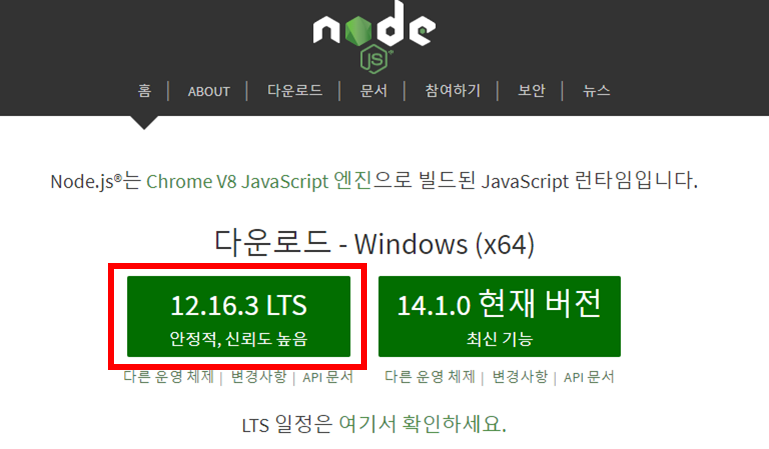

- 설치가 완료되었으면 다음과 같이 cmd창에 `node -v` 명령어를 통해서 설치된 버전확인이 가능하다.
- 만약 `node` 명령어를 못알아 먹으면 환경변수를 설정해준다.
(이거 방법은 구글링 참고하십시요.... 죄송합니다... )

    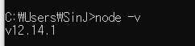

<br/>

---

<br/>

## 2) CRA (create-react-app) 설치 및 실행

- `create-react-app` 은 **react 앱 프로젝트를 생성**하는 것이라 생각하면 편합니다.
- `npm` 을 사용하는 방식과 `npx` 를 사용하는 방식 2가지가 있습니다.
    - **npm**과 **npx**의 차이 (그냥 간단하게)

        **npm** : 패키지를 로컬에 설치하고 로컬로부터 실행할 수 있게 해준다. 로컬 스토리지에 있는 패키지가 새로운 버전이 나왔을 경우, 이미 존재하는 패키지를 제거하고 다시 설치해야한다는게 가장 큰 문제이다.

        **npx** : (일회성, 휘발성) **무설치 실행**이라고 보면된다. 최신버전에 해당하는 패키지를 로컬에 설치하여 실행하고, 실행된 이후에 해당 패키지를 로컬에서 제거한다. 프로젝트의 용량이 커지며 더러워지는 것을 막을 수 있다.

- `npm`을 활용한 `create-react-app` 실행

    ```jsx
    > npm install -g create-react-app //일단 CRA 패키지를 로컬에 설치부터 해줘야한다.
    > create-react-app {프로젝트 이름} //그 다음 실행해준다.
    ```

- `npx`를 활용한 `create-react-app` 실행 **(우리는 이걸 사용합시다!!!!!!!!!)**

    만약에 `npx`로 CRA가 실행이 안되면 `npm`으로 CRA를 설치해주고 다시 시도 ㄱㄱ.

    ```jsx
    > npx create-react-app {프로젝트 이름} //로컬에 설치할 필요없이 CRA 패키지를 일회성으로 사용.
    ```

<br/>

---

<br/>

## 3) Typescript 환경 구축

- 간단합니다. 지가 알아서 프로젝트 생성해 줍니다.

    ```jsx
    > npx create-react-app --template typescript {프로젝트 이름}
    ```


- 로컬 설치 시에는 다음과 같이 해줍니다.

    ```jsx
    > npm install --save typescript @types/node @types/react @types/react-dom @types/jest
    ```

<br/>

---

<br/>

## 4) React 프로젝트 실행, 빌드파일 생성

- `npx create-react-app --template typescript react-ts-prac` 명령어를 통해서 
'react-ts-prac' 이라는 디렉토리가 지정한 경로에 생성되었을 것입니다. 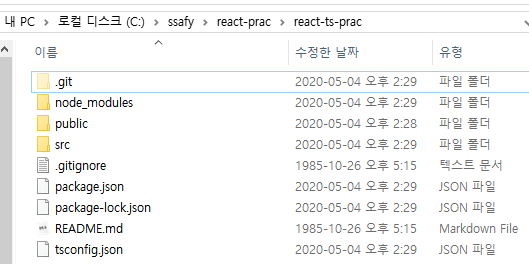

- VS Code로 한번 봅시다. `App.tsx` 파일을 열어보면 다음과 같이 이래저래 써있을 겁니다.

    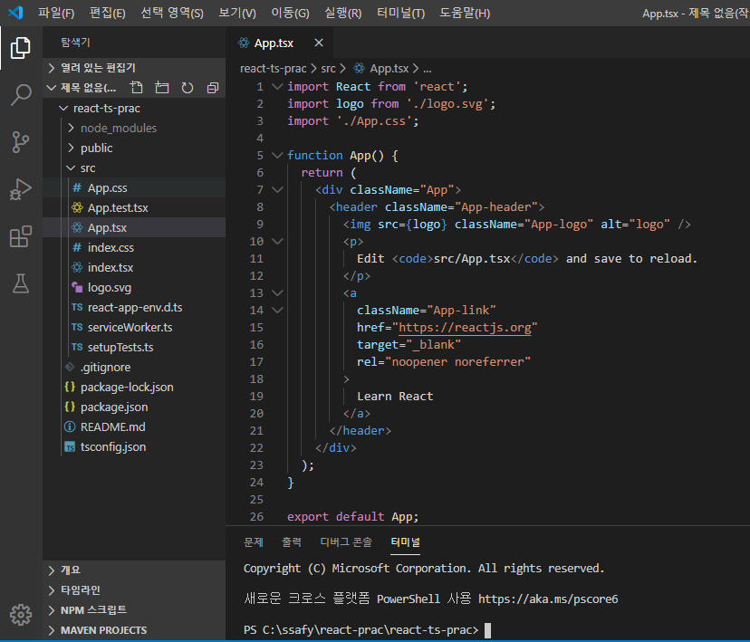

- 개발할 때, 프로젝트 디렉토리(`node_modules` 디렉토리가 존재하는 경로)에서 
  터미널에 `npm start` 를 입력해 테스트용 서버가 localhost로 실행됩니다.

    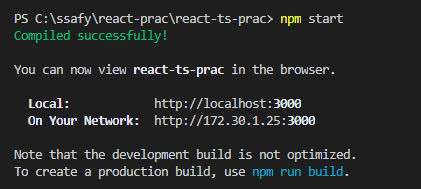

    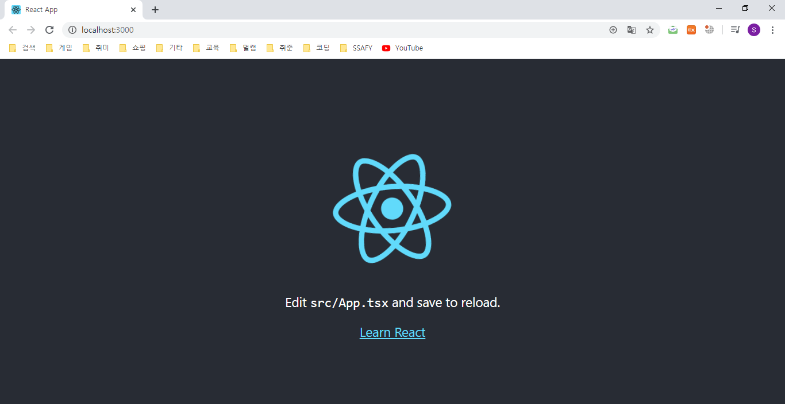

    (놀라지 마세요 이게 초기화면 입니다.)

    테스트 서버를 중단할려면 터미널에 `ctrl + C` 를 입력하면 됩니다.

- AWS에 배포하기위해 build 파일을 생성해야 할 때는 `npm run build` 명령어를 치면 됩니다.

    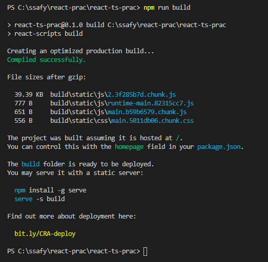

    다음과 같이 build 폴더가 생성됩니다.

    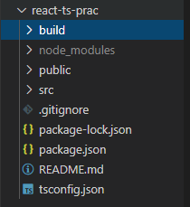

---

## 5) 패키지 관리

- 커맨드 창에 `npm install`  명령어를 입력하면,
`package.json` 파일에 써져있는 라이브러리들이 알아서 설치됩니다.
- `git`을 이용한 버전관리 시, `git pull` 하고 무조건 `npm install`을 한번 해줍시다. 
없는 라이브러리를 알아서 설치해줍니다.

    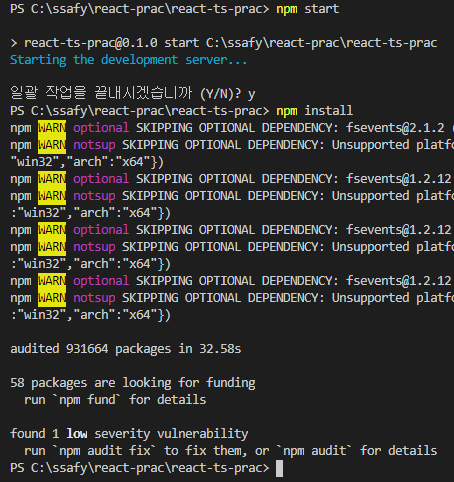

    (warning 따위 가볍게 무시해주세요.)

---

## 6) VS Code 추천 익스텐션

1. **ES7 React/Redux/GraphQL/React-Native snippets**

    React 개발한다면 그냥 국룰.

    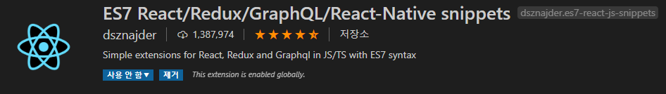

2. **Reactjs code snippets**

    얘도 그냥 국룰. **ES7 React/Redux/GraphQL/React-Native snippets** 서브.

    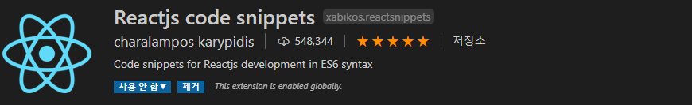

3. **JS JSX Snippets**

    얘도 서브. JSX 문법 자동완성 안되면 이것도 설치.

    

4. **ESLint**

    JS 개발한다면 그냥 국룰.

    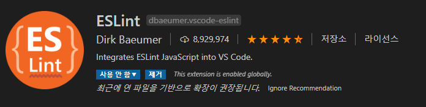

5. **JavaScript (ES6) code snippets**

    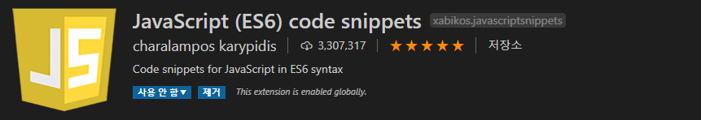

6. **Debugger for Chrome**

    구글 크롬과 통합된 디버깅 환경을 제공하는 익스텐션

    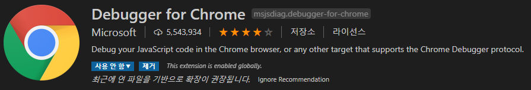

7. **vscode-styled-components**

    이거는 디자인할 때, 일반적인 css나 scss 대신 styled-components를 사용한다면 쓰기 좋은거.

    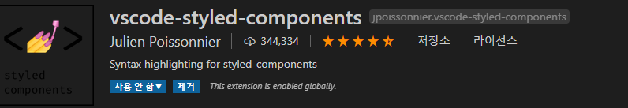

---

## +α) 구글 확장 프로그램

- **React Developer Tools**

    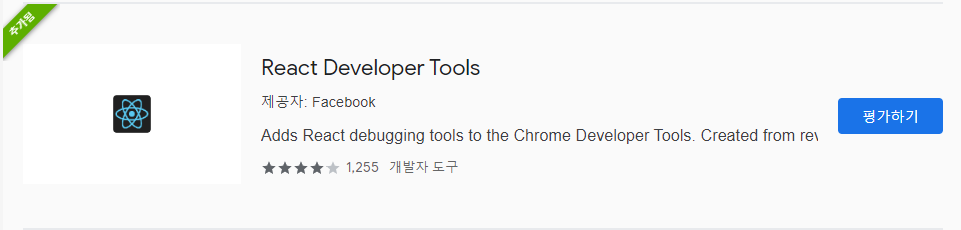

    *react* 컴포넌트 구조와 `props`, `state`를 크롬 DevTools에서 확인할 수 있게 해준다.

    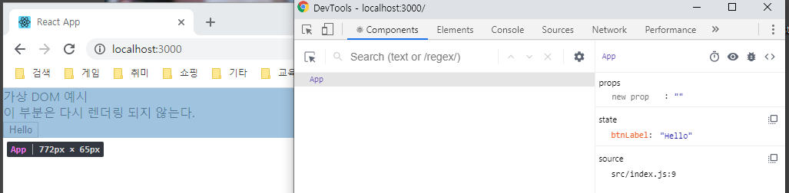