# [속성! 야매 React] 1. 기초편

Created: May 4, 2020 4:44 PM
Created By: Sinjae Kim
Tag: Frontend

**일단 해당 글을 읽고 이해 안가면 바로 카톡, 메러모스트 연락 바랍니다.**

---

<br/>


# *1. '기본'이 중요하다.*

<br/>

## 1) 선수 지식

- *React*는 *JS*기반 *Framework*이기 때문에, 당연히 *JS*(특히 *ES6*) 문법에 익숙해야한다.
- 진짜 레알루다가 기초적인거는 (변수, 함수 등등) 감으로, 센스로 알 수 있다. 
근데 다음과 같은 개념들은 **꼭 숙지**해야한다.
    - **DOM 구조**
    - 백틱 문자열
    - **===**
    - **var, const, let**
    - **이벤트**
    - **비동기**
    - **콜백함수**
    - **프로미스 / async, await**
    - **화살표함수 ( () ⇒ {} )**
- 사실 *바닐라 JS*를 알아야하는 진짜 이유는 따로있다. 
'아 나는 도저히 이걸 *React*로 구현 못하겠어....' 싶으면 그냥 *바닐라 JS*로 조지면 되기 때문이다.

<br/>

---

<br/>

## 2) JSX

- 생긴것도 *html* 태그같고, 화면상에 나타나는것도 *html* 이지만, ***html*이 아니다!!!**
- 정확히는 ***React* 엘리먼트(*Element*) 를 생성하는 새로운 문법**이다. 
*html*에 너무 적응해버린 현 시대의 웹 개발자들을 위해 *html*과 똑같은 생김새를 갖는 것 뿐이다.
- 근데 실상 *html* 태그처럼 쓰이니 걍 *html* 태그로 봐도 무방하다. 
하지만, **미세한 차이점이 있다는 것만 알고있자. 
(***html* 문법과 완전히 호환되지 않기 때문이다. 이건 차차 알아가 보자.)


### JSX에 표현식 포함하기

- *JSX*안에서 *React*나 *JS*문법을 사용할려면 중괄호를 사용하면 된다.

    ```jsx
    const msg = 'JSX에 표현식 포함하기'
    const jsx1 = <div>{msg}</div>

    //함수도 집어 넣을 수 있다.
    const msgMethod = (_msg) => {return _msg}
    const jsx2 = <div>{msgMethod('파라미터어어어어')}</div>
    ```


### JSX의 Attribute 선언

- *JSX*는 *html*과 다르게 camelCase로 attribute를 선언한다.

    ```jsx
    <div className="app">어트리뷰트는 camelCase</div>
    ```

<br/>

---

<br/>

## 3) Element

- ***React* 앱의 가장 작은 단위. 화면에 표시할 내용을 기술한다.**
- 예시

    ```jsx
    const element1 = <div>JSX</div>

    // 컴포넌트도 Element로 사용할 수 있다.
    const element2 = <Comp>컴포넌트</Comp>
    ```

- **주의 해야할 점!!** *Element*는 **무조건 하나의 태그로 묶여있어야 한다.**

    ```jsx
    const element1 = <div>이거는</div> <div>에러납니다.</div>

    const element2 = **<div>** 
    									<div>무조건</div> <div>하나의 태그로</div> <div>묶여야합니다.</div> 
    								 **</div>**
    ```

<br/>

---

<br/>

## 4) Component ☆☆☆

- **React의 핵심 of 핵심,** 컴포넌트만 잘 이해했다면 솔직히 *JSX*니, *Element*니 몰라도 된다.
- **OOP**에 **객체**라는 개념이 있으면, **React**에는 **컴포넌트**가 있다. 
**OOP : 객체 = React : 컴포넌트** ~~(비례식 이송합니다....)~~
- **화면, 이벤트, 기능 전부 컴포넌트 단위로 구현된다고 생각하면 된다!!!**
- **컴포넌트는 캡슐화하여 하나의 객체 혹은 태그처럼 사용할 수 있다!!!**
- **컴포넌트는 무조건 대문자로 시작해야한다!!!**
- 선언 방식은 **함수형**과 **클래스형**이 있는데 우리는 **클래스형**을 사용할테니 
**함수형** 컴포넌트 설명은 과감히 제낀다.


### ☆클래스형 컴포넌트

- 선언하는 방식을 예제를 통해 알아보자.

    (Typescript 까지 사용하면 복잡하고 헷갈릴테니, 지금은 ts는 사용하지 않겠다.)

    `npx create-react-app react-prac` 명령어로 react-prac이라는 프로젝트를 새로 생성한다.
    `create-react-app`하면 `App.js` 에 기본적으로 다음과 같이 작성되어있다.
    **다 필요 없다. 왜냐? 함수형 컴포넌트이기도 하고, 개발할려면 저거 다 지워야한다.** 

    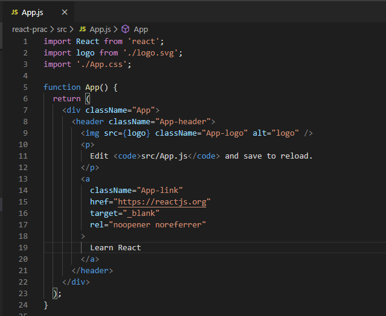

- 이게 가장 기본적인 클래스형 컴포넌트 선언 형태이다.

    ```jsx
    import React, { Component } from 'react'

    class App extends Component { // Component는 React에서 최상위 객체이다. 
                                  // App이라는 컴포넌트가 최상위 객체 Component를 상속받는다 라는 의미이다.
    	render(){
    		return(
    			// return 괄호 안은 
    			// 해당 컴포넌트를 통해 화면에 보여주고자 하는 엘리먼트가 들어가는 자리.. 라고 보면된다.
    		)
    	}
    }
    export default App; // 다른 파일에서도 App 컴포넌트를 import 할 수 있게, export 해준다는 말이다.
    ```

- `App`컴포넌트를 선언했으니 `return`안에 *JSX*구문을 입력하여 
화면상으로 'Hello React'를 띄워보자

    ```jsx
    import React, { Component } from 'react'

    class App extends Component { 
      render(){            // render 메서드는 생명주기 때 설명해 드리겠슴다.
        return(            
          <div>Hello React</div>
        )
      }
    }
    export default App;
    ```

    `npm start` 해주면 다음과 같은 화면이 나온다!!

  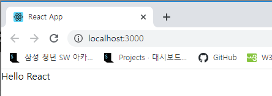

    크롬 DevTool에서 보면 *html*에서도 다음과 같이 나온다.

  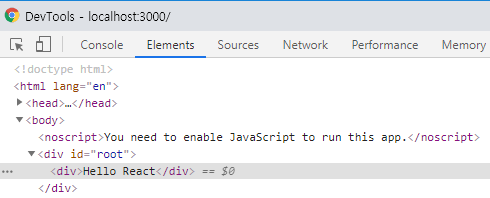

- **????** 근데 우리는 `App.js` 안에서 코드만 살짝 바꿨는데 어떻게 *html*의 *body*태그 안에 화면이 바뀌나요?

    사실 `create-react-app`을 실행시켜서 *React* 프로젝트를 생성하면
    `public/index.html` 파일과 `src/index.js` 파일이 자동으로 생성된다.

    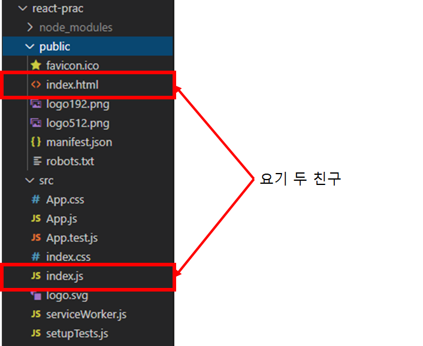

    먼저 `index.js` 파일을 보면 다음과 같다.

    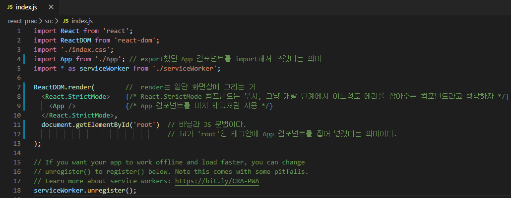

    위의 코드는 한마디로 *react*에서 제공하는 `ReactDOM`객체의 `render` 메서드를 사용해서 `id`가 `'root'`인 태그에 `App` 컴포넌트를 집어 쳐 넣겠다는 의미다.

    (*React 컴포넌트*를 *html 태그*로??? 이건 그냥 *React*가 알아서 해준다. 크게 신경쓰지말자.)

    이때 `index.html` 파일을 보면... 어라? `id`가 `'root'`인 태그가 있네?

    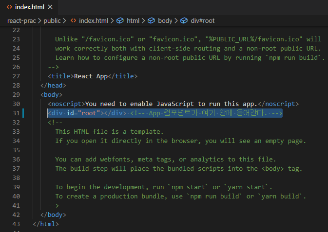

    이쯤 되면 얼추 감잡고 이해갔을거라고 본다.....

    **우리는 `App` 컴포넌트 밑에 자식 컴포넌트를 선언하고 사용함으로써 화면을 구성할 수 가 있다. 
    (진짜 특별 케이스가 아니면 우리는 `index.html`파일과 `index.js`파일을 수정해야할 이유가 전혀 없다.)**

<br/>

---

<br/>

## 5) props

- `props`는 **상위 컴포넌트**에서 **하위 컴포넌트**에게 **전달되는 변수**이다. 
상위 컴포넌트로 부터  `props`를 넘겨받은 하위 컴포넌트는 `props`를 **조회만**할 수 있고 **수정이 불가**하다.

- `props`의 활용을 예시를 통해 알아보자.

    일단 `PropsTest`라는 컴포넌트를 선언하고, `App`컴포넌트의 하위 컴포넌트로 집어 넣어보자.

    ```jsx
    //PropsTest.js 파일
    //PropsTest 컴포넌트 선언 및 export

    import React, { Component } from 'react'

    class PropsTest extends Component {
      render(){
        return( //PropsTest 컴포넌트는 return안의 JSX 태그를 화면에 렌더링한다.
          <div>
            PropsTest 컴포넌트 입니다.
          </div>
        )
      }
    } export default PropsTest;
    ```

    ```jsx
    //App.js파일

    import React, { Component } from 'react'
    import PropsTest from './PropsTest' // PropsTest 컴포넌트를 import

    class App extends Component { 
      render(){
        return(
          <PropsTest/> // 요기다가 PropsTest 컴포넌트를 선언해보자
        )
      }
    } export default App;
    ```

    화면을 보면 다음과 같이 나온다.

    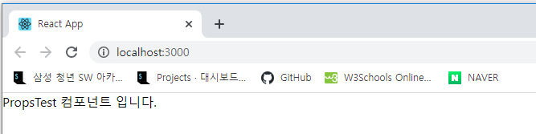

    이제 `PropsTest`컴포넌트에 `props`를 넘겨보자

    ```jsx
    //App.js파일

    import React, { Component } from 'react'
    import PropsTest from './PropsTest '

    class App extends Component { 
      render(){
        return(
          <PropsTest test={'저는 App 컴포넌트로 부터 넘어온 props 입니다.'}/> 
          // props는 attribute처럼 선언하여 넘겨줄 수 있으며 
    			// props의 이름은 임의로 지정 가능하다. 다만 id, className과 같은 keyword만 피하자.
        )
      }
    } export default App;
    ```

    ```jsx
    //PropsTest.js 파일

    import React, { Component } from 'react'

    class PropsTest extends Component { 
      render(){
        return(
          <div>
            PropsTest 컴포넌트 입니다.
            <br/>
            {this.props.test}
          </div>
        )
      }
    } export default PropsTest;
    ```

    다음과 같은 화면이 나올 것이다.

    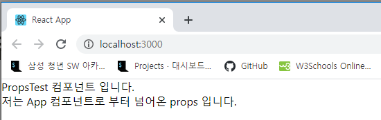

- `PropsTest.js` 파일에서 `{this.props.test}`라는 구문이 있다.

    **'내가'** 넘겨받은 **'props'** 중에 **'test'**라는 변수를 의미하는데

    뜯어보면 다음과 같은 의미이다.

    - `this` : 컴포넌트 자기자신을 의미한다. 여기서는 `PropsTest`컴포넌트를 가리킨다.
    - `props` : 최상위 객체 `Component`를 상속받으면, 기본적으로 갖게 되는 속성이다.

        말그대로 이 컴포넌트가 넘겨받은 `props`를 가리킨다.

    - `test` : `props`의 변수명이다. 상위 컴포넌트에서 지정한 변수명이랑 같아야한다.

- `App` 컴포넌트에서 `test`라는 변수에 문자열을 저장시키고

    `PropsTest` 컴포넌트에 `props`로 넘겨준 것이다.

    따라서, `PropsTest`컴포넌트에서는 `this.props.test`를 통해 화면상에 문자열을 렌더링할 수 있다.

- 추가 예제

    ```jsx
    //App.js

    import React, { Component } from 'react'
    import PropsTest from './PropsTest'

    class App extends Component { 
      render(){
        return(
          <div>
            <PropsTest test={'props 1번 입니다.'}/>
            <br/>
            <PropsTest test={'props 2번 입니다.'}/>
            <br/>
            <PropsTest test={'props 3번 입니다.'}/>
          </div>
        )
      }
    } export default App;
    ```

    ```jsx
    //PropsTest.js

    import React, { Component } from 'react'

    class PropsTest extends Component {
      render() {
        return (
          <div>
            PropsTest 컴포넌트 입니다.
            <br />
            {this.props.test}
          </div>
        )
      }
    } export default PropsTest;
    ```

    결과 화면

    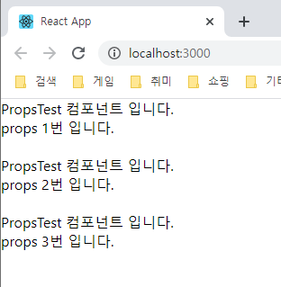

<br/>

---

<br/>

## 6) state

- `**state`는 컴포넌트가 갖고 있는 일종의 지역변수이다. `state`는 값 수정이 가능하다.**

    ```jsx
    // StateTest.js

    import React, { Component } from 'react';

    class StateTest extends Component {
      constructor(props){
        super(props)
        this.state = {
          myState: '저는 StateTest 컴포넌트의 state 중 하나입니다.',
        }
      }

      render() {
        return(
          <div>
            {this.state.myState}
          </div>
        )
      }
    } export default StateTest;
    ```

    ```jsx
    //App.js

    import React, { Component } from 'react'
    import StateTest from './StateTest'

    class App extends Component { 
      render(){
        return(
          <div>
            <StateTest/>
          </div>
        )
      }
    } export default App;
    ```

    결과화면

    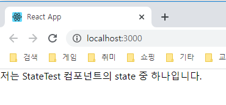

### setState()

- `state`는 `props`와 다르게 값 변경이 가능하다. 
**하지만, `state`의 값을 바꿀려면 `setState()` 메서드를 사용해야한다.**

    버튼을 클릭하면 라벨이 바뀌는 간단한 코드를 짜보자.

    ```jsx
    //App.js

    import React, { Component } from 'react'

    class App extends Component { 
      constructor(props){
        super(props)
        this.state = { // state 선언
          btnLabel: 'Hello'
        }
      }

      clickBtn = () => { // 버튼 클릭 이벤트가 발생하면 작동되는 콜백 메서드

        if(this.state.btnLabel === 'Hello'){
          // setState 메서드로 state 값을 바꾼다. 
    			// this를 붙이는 이유는 클래스형 컴포넌트이기 때문이다.
    			this.setState({ 
            btnLabel: 'React'
          })
        }
        else{
    			// setState 메서드로 state 값을 바꾼다.
          this.setState({ 
            btnLabel: 'Hello'
          })
        }
      }

      render(){
        return(
          <div>
            <button onClick={this.clickBtn}>
    					{this.state.btnLabel}
    				</button>
          </div>
        )
      }
    } export default App;
    ```

  결과화면

  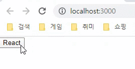

    - **주의해야할 점!!!!**

        `**setState()` 메서드는 아무때나 사용할 수 없다!!!**

        사용할 수 있는 스코프 범위가 정해져있다.

        이거는 생명주기 설명할 때 기술하겠다.

        **그리고 비동기적으로 작동한다!!!**

<br/>

---

<br/>

## +α) 가상 DOM

- `state` 설명했으니 겸사겸사 **가상 DOM**에 대해 설명하겠다.
- 일단 *React*는 화면이 새롭게 바뀌면, 전부 바뀌지않고 **바뀌는 부분만 바뀐다**.

    어떻게?? **가상 DOM**을 활용하기 때문이다.

    화면이 바뀔 때, *React*는 화면에 먼저 렌더링을 하지않고 

    가상 DOM에 한번 렌더링을 시전한다.

    그 다음 이전 화면과 가상 DOM을 비교하면서 바뀌는 부분만 화면에 렌더링을 한다.

- 위에 만든 버튼 예제를 통해 느낌 한 번 봐보자.

    크롬 DevTools를 보면 `button` 태그만 바뀌는 것을 알 수 있다.

    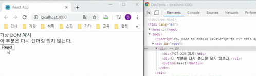

---


오빠 오늘 어른이날인데 쉬세요...ㅠ

*얘들아 전국 1등해야지...*

