# [속성! 야매 React] 2. 중급편

Created: May 5, 2020 3:37 PM
Created By: Sinjae Kim
Tag: Frontend

**일단 해당 글을 읽고 이해 안가면 바로 카톡, 메러모스트 연락 바랍니다.**

---

<br/>

# *2. 본격적으로 React를 갖고 놀아보자*

<br/>

## 1) 생명주기 (Life Cycle)

- ~~갓명주기~~ **정말 정말 진짜 레알루다가 중요한 개념.**
- **컴포넌트가 생성되고, 갱신되고, 제거되는 과정**을 말한다.
- 생명주기를 모른다면 당신은 React 쓸 자격이 없다.... ~~돌아가...~~

### i) 생명주기 메서드 (Life Cycle API)

- **클래스형 컴포넌트**라면 기본적으로 제공되는 메서드들이다. 

  함수형 컴포넌트에는 이 친구들이 없다.

- 생명주기의 각 단계에 따라 **자동적, 순차적**으로 작동된다.

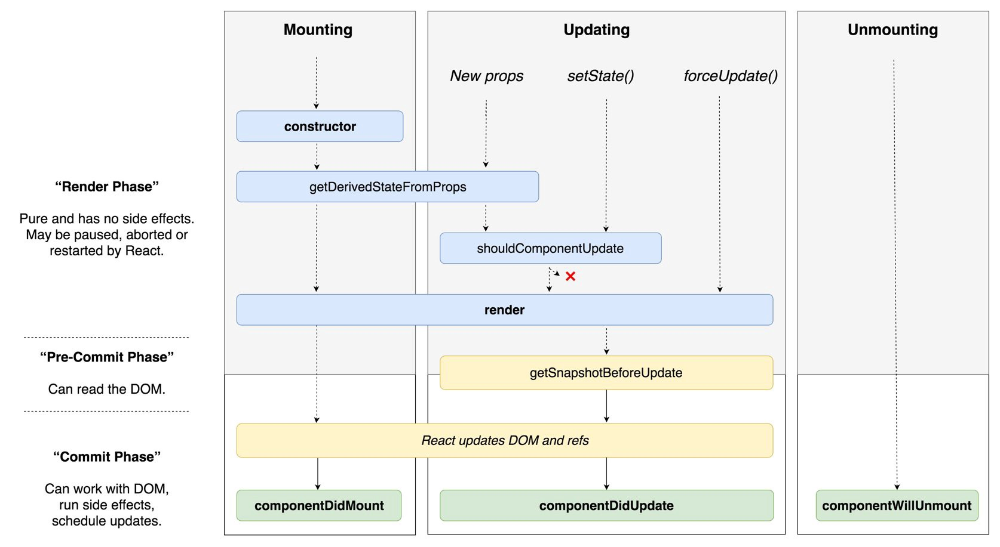

**자주 사용하는 메서드만 설명하겠다. 
나머지 메서드에 대해서 궁금한게 생기면 언제든지 연락 환영, 아니면 공식문서 참고** 

- **Mounting (컴포넌트 생성) :**

    컴포넌트가 처음 생성될 때, **마운트**라는 표현을 쓴다. 

    결과물로 나온 Element들이 가상 DOM에 삽입되고 실제 DOM을 업데이트하기까지의 과정을 말한다.

    - **1. `constructor()`**
      
        - 컴포넌트 **생성자 메서드**이다. 마운트되기 전에 호출된다.
        - 컴포넌트가 **생성될 때 단 한번 실행**된다.
        - 이 메서드에서만 **state 초기화**와 **메서드 바인딩**이 가능하다.
            - `this.state`에 객체를 할당하여 **state**를 초기화
        - 메서드를 바인딩하거나 **state**를 초기화하는 작업이 없다면, 생성자를 구현하지 않아도 된다.
        - 생성자를 구현할 때에는 다른 구문에 앞서 `super(props)`를 호출해야 한다. 그렇지 않으면 `this.props`가 생성자 내에서 정의되지 않아 버그로 이어질 수 있다.
        - **주의 할점!!!** **state**에 **props**를 복사하지 말자. **불필요한 작업**이며 **버그를 발생**시킨다.

        ```jsx
        import React, { Component } from 'react'

        class App extends Component {

        	constructor(props){
            super(props)
        		//this.state = { color: this.props.color }  
                // state에 props를 복사하지말자!
            this.state = { msg: 'Hello, React' }   // this.state를 통한 state 초기화
                this.handler = this.handler.bind(this) // 메서드 바인딩
          }
        	
        	/* 생략 */
        	
        } export default App;
        ```
        
    - **2. `render()`** 
      
        - **화면을 그리는 함수**라고 생각하면 된다.
        - 클래스형 컴포넌트에서 **반드시 구현돼야하는 유일한 메서드**이다. 
        **이 메서드가 컴포넌트에 없으면 바로 에러**뜬다.
        - 최종적으로 컴포넌트에서 작업한 결과물을 `return`하는 메서드이다.
        따라서 **`return` 구문 이 없으면 바로 에러, `return` 하는게 없어도 에러**
        - `return` 되어야하는 것들은 다음과 같다
            1. React Element : 보통 JSX를 쓴다.
            2. 배열과 Fragments : 추후 설명하겠다.
            3. Boolean or Null : 추후 설명하겠다.
            4. String or Number : DOM상의 Text 노드로 렌더링 된다.
            5. Portal : 별도의 DOM 하위 트리에 자식 엘리먼트를 렌더링한다. (거의 써본적 없)

        ```jsx
        import React, { Component } from 'react'
        class App extends Component {
            /* 생략 */
        
        	render(){
        		return(
        			<div>반드시 구현해야 합니다.</div>
        		)
        	}
       } export default App;
       ```
       
    - **3. `componentDidMount()`**    
        - 컴포넌트가 마운트된 직후, 즉 DOM 트리에 삽입된 직후에 호출된다.
        - 다음과 같은 경우에 주로 활용된다.
            1. DOM 노드를 확인하고 초기화해야 하는 작업이 있는 경우
            ex) 모달처럼 DOM에 마운트되고 크기나 위치를 확인한 다음 작업을 진행하는 경우
            2. 외부의 데이터를 불러오거나 네트워크 요청을 보내야하는 경우
            3. 타이머 설정
        - `setState()` 메서드가 많이 사용되는 위치이다.
        - `addEventListener()` 메서드를 설정하기 좋은 위치이다.

        ```jsx
        import React, { Component } from 'react'

        class App extends Component {

        	/* 생략 */

        	componentDidMount(){
        		
        		// 마운트된 DOM의 정보를 가져올 때
        		const rootWidth = document.getElementById('root').offsetWidth
        		
        		// 이벤트 리스너를 추가할 때
        		window.addEventListener('resize', 
                                        () => {this.setState({ windowWidth: window.innerWidth })})
        		
        		// setState() 사용할 때, setTimeout()등 타이머를 설정할 때,
        		// AJAX 요청할 때 등등 사용하기 좋은 위치이다.
        	}

          /* 생략 */

        } export default App;
        ```
        
        

- **Updating (컴포넌트 업뎃) :**

    처음 마운트 후, 업데이트가 진행되는 경우는 다음과 같다.

    - 상위 컴포넌트로부터 갱신된 **props**를 받는 경우
    - `setState()` 로 자신의 **state** 값을 변경할 경우
    - **1. `render()`**
        - 업데이트가 시작되면 `render()` 메서드가 맨 처음 실행되어 화면을 바꾼다.
        - `render()` 메서드에 대한 자세한 설명은 위에서 했으니 넘어간다.
    - **2. `componentDidUpdate()`**
        - 업데이트가 시작해서 렌더링이 끝나면 바로 호출된다.
        - 최초 렌더링, 즉 **마운트 단계에서는 호출되지 않는다.**
        - 기본적으로 `prevProps`, `prevState`, `snapshot` 이라는 파라미터를 받을 수 있다. 
        사용 안할거면 굳이 괄호안에 명시안해도 된다.
            - `prevProps`

                업뎃 되기 전 **props**를 인자로 받을 수 있다. 
                이전 props와의 변경사항을 확인 한 후, 추가적인 액션을 설정하는 것에 유용하다.

                ```jsx
                componentDidUpdate(prevProps){
                	if(this.props.name !== prevProps.name){
                		this.setState({
                			/* 생략 */
                		})
                	}
                }
                ```

            - `prevState`

                `prevProps` 와 비슷하다. 업뎃 되기 전 **state**를 인자로 받을 수 있다.
                이전 **state**와 비교하여 실행여부를 확인할 때 주로 사용된다.

                ```jsx
                componentDidUpdate(prevProps, prevState){ //prevProps를 사용 안하더라도 무조건 2번때 파라미터에 넣어줘야한다.
                	if(this.state.name !== prevState.name){
                		this.setState({
                			/* 생략 */
                		})
                	}
                }
                ```

            - `snapshot`

                생명주기 메서드 중 `getSnapshotBeforeUpdate()` 메서드를 사용했다면 세번째 인자로 `snapshot`을 받을 수 있다. **많이 안쓴다. 나도 안쓴다. 그냥 쓰지말자** 

        - **주의 할점!!!!** `componentDidUpdate()` 메서드 안에 `setState()`를
        **그냥 쌩으로 사용하면 무한루프에 빠진다.
        무조건 무조건 무조건 조건문으로 묶어서 써야한다.**
        `prevProps`, `prevState` 예시 코드를 다시 한번 보자.

            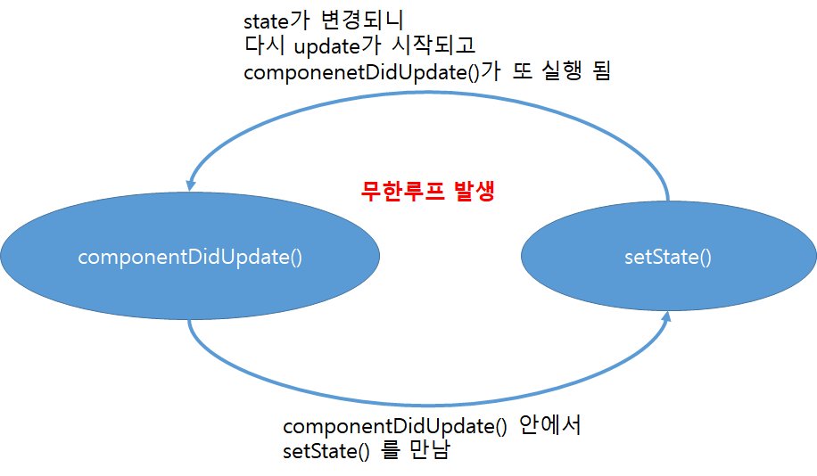

    

- **Unmounting (컴포넌트 제거) :**

    컴포넌트가 제거되는 단계이다. (DOM에서 삭제되는 단계, 화면에서 없어지는 단계)

    - **1. `componentWillUnmount()`**
        - 컴포넌트가 제거되기 직전에 호출된다.
        - `componentDidMount()`에서 추가한 이벤트 리스너나 타이머를 해제할 때, 네트워크 요청을 취소할 때 활용된다.

        ```jsx
        import React, { Component } from 'react'

        class App extends Component {

        	/* 생략 */

        	componentWillUnmount(){

        		// 이벤트 리스너를 해제할 때
        		window.removeEventListener('resize', /*생략*/ )
        													
        	}

          /* 생략 */

        } export default App;
        ```

    

- **예제**를 통해서 감을 잡아보자.

    생명주기 메서드에 `console.log()` 찍고 확인해 보자.

    ```jsx
    //App.js
    import React, { Component } from 'react'

    class App extends Component { 
      constructor(props){
        super(props)
        this.state = {
          appState: 'Hello'
        }
        console.log('construct App')
      }

      componentDidMount(){
        console.log('did mount App')
      }

      componentDidUpdate() {
        console.log('did update App')
      }

      btnClick = () => { //버튼 클릭을 통해 state 값을 변경한다.
        if(this.state.appState === 'Hello'){
          this.setState({
            appState: 'React'
          })
        }
        else{
          this.setState({
            appState: 'Hello'
          })
        }
      }

      render(){
        console.log('render App')
        return(
          <div>
            <div>App 컴포넌트</div>
            <button onClick={this.btnClick}>{this.state.appState}</button>
          </div>
        )
      }
    } export default App;
    ```

    DevTools 키고 결과 화면을 보자

    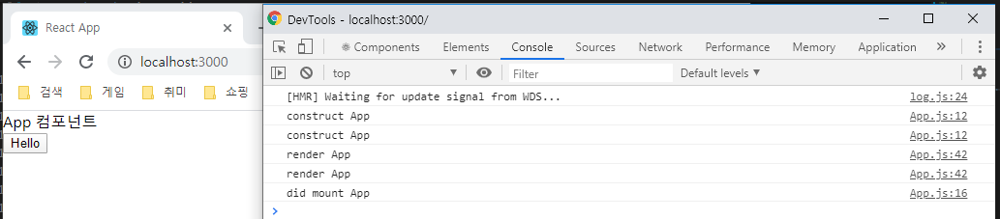

    (`constructor()`, `render()` 메서드가 왜 2번 호출 되는지는 아직은 신경안써도 된다. ~~솔직히 필자도 기억안남....~~)

    처음 마운트 될 때, 로그가 construct → render → did mount 순서로 찍히는 것을 알 수 있다.

    이제 버튼 클릭 이벤트를 통해 state를 바꿔서 업뎃을 해보자.

    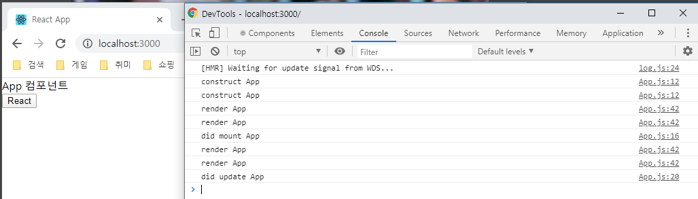

    render → did update 순서로 로그가 찍히는 것을 알 수 있다.

    버튼 클릭 한번 더 해보겠다.

    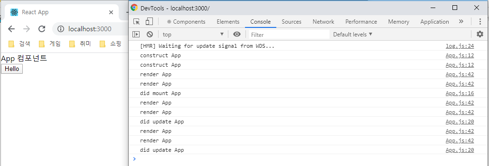

    이걸보면 알 수 있듯이 마운트는 처음에 생성할 때 한 번만 이루어지고 
    이후에는 업뎃만 되는 것을 확인할 수 있다.

### ii) `setState()`는 어느 시점에 사용할 수 있는가?

- `setState()`는 렌더링이 끝난 **정적인 상태**에서만 사용해야 한다. 
안그러면 바로 기냥 무한루프에 빠지는 비극을 야기한다.
- 일단 **이벤트 콜백** 안에서는 자유롭게 사용할 수 있다.
****(지금까지 보여줬던 버튼 예제를 보면 알 수 있다.)
**이벤트 리스너** 자체가 정적인 상태에서 대기중이기 때문이라고 생각하면 편하다.
    - 잠깐! **이벤트 콜백**이 뭐냐고??

        먼저, **이벤트 리스너**(**이벤트 핸들러** 라고도 한다)란 이벤트를 감지하는 친구이고
        이벤트 리스너에 의해 이벤트가 감지되면 지정한 메서드가 작동한다. 

        이때 지정한 메서드를 **콜백**이라고 부른다.

        콜백이 의미하는 것이 많아서...
        혼동없게 이벤트 리스너에 지정된 콜백을 **이벤트 콜백**이라고 하겠다.

    ```jsx
    btnClick = () => {
      if(this.state.appState === 'Hello'){
        this.setState({
          appState: 'React'
        })
      }
      else{
        this.setState({
          appState: 'Hello'
        })
      }
    }
    ```

- 그렇다면 어떤 ***생명주기 메서드*** 안에서 쓸 수 있는가??
    - **(Ｘ)** `constructor()` : **state**를 초기화하기 때문에 `setState()`를 **사용할 필요가 없다.**
    - **(Ｘ)** `render()` : 여기서는 `setState()`를 쓰면 **무한루프에 빠진다.** 화면이 그려지는 동적인 상태이기 때문이다.
    - **(O)** `componentDidMount()` : `setState()` **사용이 가능한 공간**이다. 사용하는 경우는 위에 설명을 참고.
    - **(△)** `componentDidUpdate()` : 위에서도 설명했듯, **조건문으로 이전 props 혹은 state을 비교하고 사용해야한다.** 안그러면 **무한루프.**
    - (**Ｘ**) `componentWillUnmount()` : 어차피 없어지는 컴포넌트라 `setState()`를 **사용할 이유가 없다.** 쓴다고해서 문제될건 없는데... 그냥 못 쓴다고 생각하자.

### iii) 상하관계가 있는 컴포넌트의 생명주기

- 케이스를 나눠서 확인해보자
    - 예제 소스코드

        App이 상위 컴포넌트, Child가 하위 컴포넌트

        ```jsx
        //App.js
        import React, { Component } from 'react'
        import Child from './Child'

        class App extends Component { 
          constructor(props){
            super(props)
            this.state = {
              appState: 0,
              appProps: 0,
            }

            console.log('construct App')
          }

          componentDidMount(){
            console.log('did mount App')
          }

          componentDidUpdate() {
            console.log('did update App')
          }

          changeState = () => {
            this.setState({
              appState: this.state.appState + 1
            })
          }
          changeProps = () => {
            this.setState({
              appProps: this.state.appProps + 1
            })
          }

          render(){
            console.log('render App')
            return(
              <div>
                <div>상위 컴포넌트</div>
                <div>state : {this.state.appState}</div>

                <button onClick={this.changeState}>상위 컴포넌트의 state를 변경하는 버튼</button>
                <br/>
                <button onClick={this.changeProps}>props를 갱신하는 버튼</button>

                <hr/>
                <Child appProps={this.state.appProps}/>
              </div>
            )
          }
        } export default App;
        ```

        ```jsx
        //Child.js
        import React, { Component } from 'react';

        class Child extends Component {
          constructor(props){
            super(props);
            this.state = {
              childState: 0,
            }

            console.log('construct Child')
          }

          componentDidMount(){
            console.log('did mount Child')
          }

          componentDidUpdate(){
            console.log('did update Child')
          }

          changeState = () => {
            this.setState({
              childState: this.state.childState + 1
            })
          }

          render(){
            console.log('render Child')
            return(
              <div>
                <div>하위 컴포넌트</div>
                <div>state : {this.state.childState}</div>
                <button onClick={this.changeState}>하위 컴포넌트의 state를 변경하는 버튼</button>
                <div>상위 컴포넌트로 부터 넘겨받은 props : {this.props.appProps}</div>
              </div>
            )
          }

        } export default Child;
        ```

    - 1. 마운트

        하위 컴포넌트의 마운트가 끝나면 상위 컴포넌트의 마운트가 완료된다.

      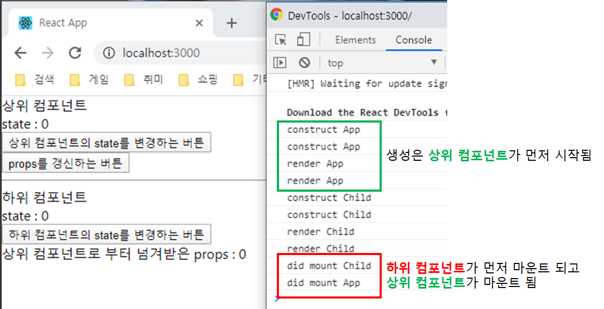

    - 2. 하위 컴포넌트에서 **state**를 변경했을 때

        하위 컴포넌트의 버튼을 클릭해서 **state**를 바꿔보자.

      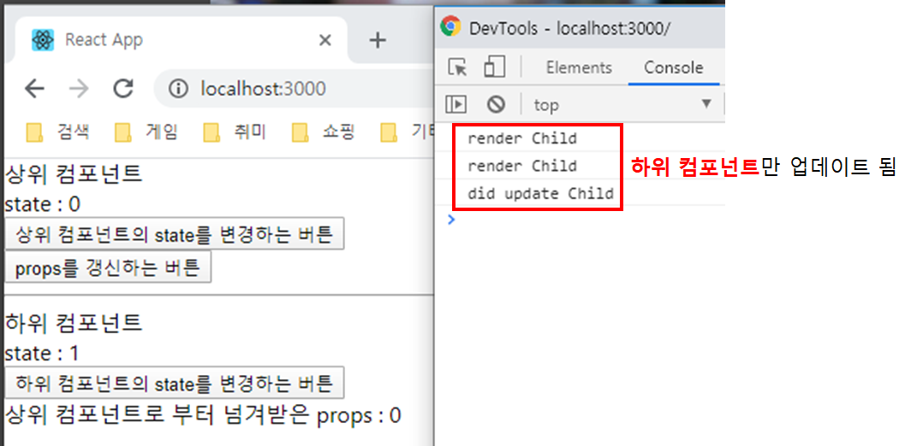

    - 3. 상위 컴포넌트에서 **props**를 갱신했을 때

        상위 컴포넌트의 버튼을 클릭해서 **props**를 갱신해보자

      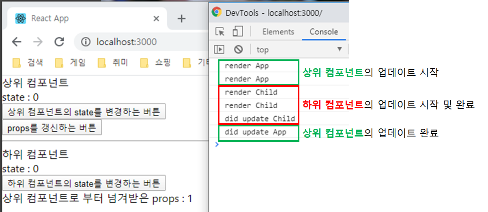

        사실 그림상에서 상위 컴포넌트의 업데이트가 발생하는 이유는...

        하위 컴포넌트에게 넘겨줄 **props**를 갱신하기위해 
        상위 컴포넌트의 **state**를 변경해서 발생하는 업데이트이다.

    - 4. 상위 컴포넌트에서 **state**를 변경했을 때 ★

      상위 컴포넌트의 버튼을 클릭해서 **state**를 바꿔보자

      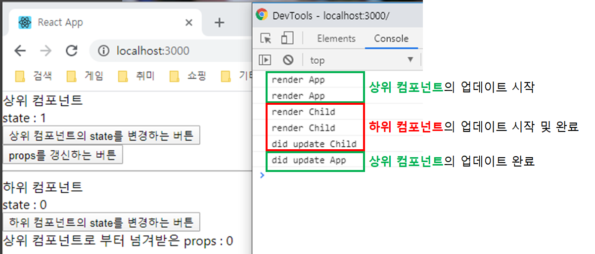

      하위 컴포넌트는 바뀌는게 없는데 업데이트가 진행된다. **기본적으로 상위 컴포넌트가 업데이트를 시작하면, 하위 컴포넌트도 업데이트가 되도록 설정**되어있기 때문이다.

      이게 컴포넌트의 깊이가 깊지 않으면 크게 상관없긴 한데... 만약에 깊어진다면??????
      

**성능 저하가 눈에 보일수가 있다!!!**
      
  - **해결하는 방법??**
    
      아 언급하고 싶지않았는데....
      
      생명주기 메서드 중에 `shouldComponentUpdate()`라는 메서드가 있다.
      
      **`shouldComponentUpdate()`**의 특징?
      
            - 사실 업데이트 단계에서 `render()`보다 먼저 작동된다. ~~속여서 미안하다...~~
            - 사용한다면 **무조건 boolean값을 return해주어야 한다.**
            - 2개의 파라미터를 기본적으로 가진다. `nextProps`와 `nextState`이다.
            이 파라미터를 통해서 **props**나 **state**의 변화를 비교할 수 있다.
      - **성능 최적화**만을 위해 존재하는 메서드이다. 이 메서드를 통해서 렌더링을 방지하면 버그가 발생한다.
      
            `shouldComponentUpdate()`메서드는 기본적으로 `true`를 리턴한다.
      
        만약 이 메서드가 `false`를 리턴하면?? **업데이트 과정이 바로 종료된다!!!!!!!!!!!!**
      
      그렇기 때문에 다음과 같이 활용하여 성능 최적화를 이룰 수 있다.
      
            ```jsx
            // 예제 소스코드 중 Child.js 파일에서 이 코드를 추가로 입력해보자.
      // 뭐 적당히 componentDidMount 메서드 선언한거 밑에다가 써보자.
      
            shouldComponentUpdate(nextProps, nextState){
            	// 컴포넌트가 받는 props에 변화가 일어나는 경우 체크
        const propsDifference = this.props.appProps !== nextProps.appProps;
      
            	// 컴포넌트의 state에 변화가 일어나는 경우 체크
            	const stateDifference = this.state.childState !== nextState.childState;    
               
            	// 둘 중에 하나라도 변화가 생기면 true를 리턴하고 
            	// 둘 다 변화가 없으면 false를 리턴한다.
            	return propsDifference || stateDifference;
            }
      ```
      
      그러면 밑에 처럼 상위 컴포넌트만 업데이트를 시킬 수 있는 결과를 얻을 수 있다.
      
            하위 컴포넌트의 **props**나 **state**에 아무 변화가 없기 때문에 
      `shouldComponentUpdate()`메서드가 하위 컴포넌트의 업데이트를 막는 것이다.
      
        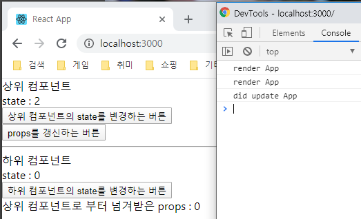
      ```

​    

아무리 야매라도 생명주기는 확실하게 집고 넘어가야하기 때문에 설명이 엄청 길어졌다.
앞으로 나올 개념들은 간단(?)하기 때문에.. 생명주기 공부하면서 긴장했던거 풀길....

<br/>

---

<br/>

## 2) 메서드 바인딩

- 일단 우리가 **클래스형 컴포넌트**를 써야하기 때문에 `this`라는 개념이 매우 중요하다.
- **메서드 바인딩**이란 **'메서드를 클래스에 묶어주는 것(bind)'**이라고 생각하면 된다.
- 참고로 **생명주기 메서드**는 바인딩이 필요없다.
- 주로 **이벤트 콜백**에 적용한다.

- 예제를 통해 **메서드 바인딩**이 왜 사용되는지 알아보자

    ```jsx
    // 버튼을 누르면 카운트하는 앱을 만들어 보자~~

    import React, { Component } from 'react'

    class App extends Component {
      constructor(props){
        super(props)
        this.state = {
          count: 0,
        }
      }

      upCount(){ // 이벤트 콜백
        this.setState({
          count: this.state.count + 1,
        })
      }

      render(){
        return(
          <div>
            <div>바인딩 예제</div>
            <br/>
            <button onClick={this.upCount}>Count Up !!!</button>
            <br/><br/>
            <div>Count : {this.state.count}</div>
          </div>
        )
      }

    } export default App;
    ```

    야심차게 위와 같이 코드를 작성하고 버튼을 눌러보는데....

    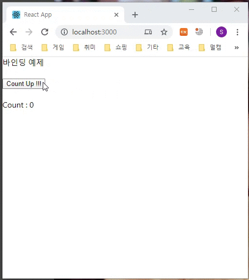

    !!!!!!!!!!!!!!!??????????? **에러**가 뜬다.

    왜냐??? **바인딩 처리를 안해줘서 `upCount()` 메서드 안의 `this`가 컴포넌트를 가리키지 않기 때문이다!!!!** 
    
    **바인딩 처리를 안해주면 메서드안의 `this`는 메서드 자신을 가리킨다.**

    ```jsx
upCount(){
        this.setState({ // 즉, 여기 선언된 this는 컴포넌트가 아니라 upCount 메서드을 가리키는 것
          count: this.state.count + 1,
        })
      }
    ```
    
    그렇기 때문에 에러 메세지도 다음과 같이 뜨는거다. 
    ('`this` 안에는 `setState`가 없습니다~~ 뭔지 모르겠어요~~')

    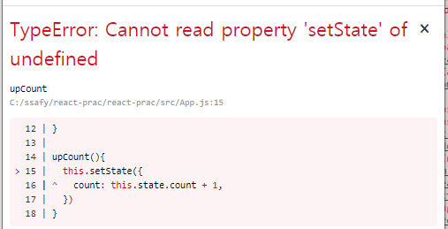
    

따라서 **메서드 바인딩**을 통해 이벤트 콜백안의 `this`가 **컴포넌트를 가리키도록** 만들어야한다!!

### i) 바인딩 하는 법

- 바인딩 하는 방법은 대표적으로 2가지가 있다.
    1. `constructor()`안에 바인딩을 선언한다.
        - 예제 코드

            ```jsx
            // 첫번째 방법.
            // constructor()안에 바인딩을 선언한다.

            class App extends Component {
              constructor(props){
                super(props)
                this.state = {
                  count: 0,
                }
            		
            		// 콜백에서 this가 제대로 작동하려면 아래와 같이 바인딩 해주어야 한다.
            		this.upCount = this.upCount.bind(this)
              }

              upCount(){ // 이벤트 콜백
                this.setState({
                  count: this.state.count + 1,
                })
              }

             /* 생략 */

            } export default App;
            ```

    2. 사용 시점에 바인딩을 선언한다.
        - 예제 코드

            ```jsx
            // 두번째 방법.
            // 사용되는 시점에 바인딩을 선언한다. button 태그 주목

            class App extends Component {
              
            	/* 생략 */

              upCount(){ // 이벤트 콜백
                this.setState({
                  count: this.state.count + 1,
                })
              }

            	render(){
                return(
                  <div>
                    <div>바인딩 예제</div>
                    <br/>
                    <button onClick={this.upCount.bind(this)}>Count Up !!!</button>
                    <br/><br/>
                    <div>Count : {this.state.count}</div>
                  </div>
                )
              }

            } export default App;
            ```

- 바인딩을 해주면 앱이 잘 작동하는 것을 확인할 수 있다.

    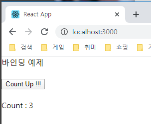

### ii) 화살표 함수 ★

- 근데... 그 동안의 예제 코드를 살펴보면 필자는 이벤트 콜백에 대해 바인딩을 안하고 있다.
- 차이점은 딱 하나.... **화살표 함수를 사용했다**는 점이다. 
화살표 함수는 **자동으로 바인딩**을 해준다.
코드가 훨씬 간결해지고, 바인딩 선언 까먹어서 버그 생길 이유도 없어진다.

  솔직히 위의 내용은 다 잊어도 된다... 그냥 개념적으로 바인딩이 무엇이고, 왜 화살표 함수를 써야하는지 알려주고 싶은 의도였다..
  
  ```jsx
    import React, { Component } from 'react'
  
  class App extends Component {
      
    	/* 생략 */
  
    upCount = () => { // 바인딩 선언이고 뭐고, 화살표 함수로 만들면 끝난다.
        this.setState({
          count: this.state.count + 1,
        })
      }
  
    /* 생략 */
  
  } export default App;
  ```

---

## 3) 이벤트 처리

- 크게 설명할건 없는데 이것만 알고있자.
    - **1.** **React**에는 **컴포넌트 태그**나 **JSX 태그**가 **대부분의 이벤트 리스너를 attribute로 갖고있다.**

        따라서 이벤트 리스너를 추가하기 위해 `addEventListener()` 메서드를 사용할 필요가 거의없다.

        ```jsx
        // 메서드 바인딩에 썼던 코드에서
        // '바인딩 예제'라고 써있는 div태그에 저렇게 onClick 이벤트 리스너를 선언하고
        // '바인딩 예제'라고 쓰여져 있는 부분을 클릭하면 카운트가 올라간다.

        <div onClick={this.upCount}>바인딩 예제</div>
        ```

        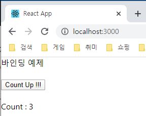

        - **얼마나 많은 이벤트 리스너를 지원하는지 공식문서에서 확인해보기 바람**

            [https://ko.reactjs.org/docs/events.html](https://ko.reactjs.org/docs/events.html)

    - **2.** **컴포넌트 태그**나 **JSX 태그**에 이벤트 리스너를 선언할때는 무조건 **camelCase**

        ```jsx
        <div onClick={/*생략*/}>온 클릭</div>

        <div onChange={/*생략*/}>온 체인지</div>

        <div onFocus={/*생략*/}>온 포커스</div>
        ```

    - **3.** **event 파라미터**

        ```jsx
        // 바인딩 예제 다시 또 등장
        // upCount() 부분을 한번 주목해보자.
        // div 태그와, button 태그에 id attribute도 추가해주었다.

        import React, { Component } from 'react'

        class App extends Component {
          constructor(props){
            super(props)
            this.state = {
              count: 0,
            }
          }

          upCount = (event) => { // 이렇게 파라미터에 명시를 해주면, 이벤트 객체를 받아올 수 있다.
            console.log(event.currentTarget.id) // 현재 타겟의 id를 콘솔로 찍어보겠다.
            this.setState({
              count: this.state.count + 1,
            })
          }

          render(){
            return(
              <div>
                <div id='div tag' onClick={this.upCount}>바인딩 예제</div>
                <br/>
                <button id='button tag' onClick={this.upCount}>Count Up !!!</button>
                <br/><br/>
                <div>Count : {this.state.count}</div>
              </div>
            )
          }

        } export default App;
        ```

        위의 코드를 실행하면

        `div` 태그를 클릭 시 'div tag'가 콘솔에 찍히고
        `button` 태그를 클릭 시 'button tag'가 콘솔에 찍힌다.

        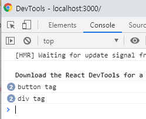

        이걸로 활용할 수 있는게 진짜 많다. 근데 지금은 이 정도만 알고있자

        ~~근데 이게 **typescript**를 쓰면 진짜 짜증나는게...~~ 
        ~~**event**에 대한 **타입**를 정확하게 명시해주어야 한다.....~~ 
        ~~무슨말이냐고? 직접 **typescript** 써보면 알게 될 것이다...~~ 
        ~~조바심 낼거 없다.. 가까운 미래이다...~~

        ~~TS 안쓴다고? 개꿀~~~~~~~

        ~~🤮 이벤트 타입 주금ㅠㅠㅠㅠ~~

<br/>

---

<br/>

## 4) 조건부 렌더링

- 말 그대로 **조건에 따라서 렌더링**을 하겠다는 말이다.

- 예제를 통해 알아보자

    이번에는 간단한 메뉴탭을 한번 만들어보겠다. 가장 이상적인 예시라고 생각되기 때문이다.

    ```jsx
    import React, { Component } from 'react';
    import './App.css'

    class App extends Component{
      constructor(props){
        super(props)
        this.state = {
          curMenu: 'menu1'
        }
      }

      changeTab = (event) => { // 이벤트 콜백을 통해 state를 바꾼다.
        console.log(event.currentTarget.className)
        this.setState({
          curMenu: event.currentTarget.className
        })
      }

      render(){
        return(
          <div className='app'>
            <div className='menu-container'>
              <div className='menu1' onClick={this.changeTab}>Menu1</div>
              <div className='menu2' onClick={this.changeTab}>Menu2</div>
              <div className='menu3' onClick={this.changeTab}>Menu3</div>
            </div>
            <div className='board-container'>
            { 
              // 여기서부터 조건부 렌더링, 조건식에 따라 렌더링을 한다.
              // curMenu가 menu1이면 && 뒤의 엘리먼트를 렌더링한다.
              this.state.curMenu === 'menu1' && <div className='board1'><div className="msg">Board 1</div></div>
            }
            {
              // curMenu가 menu2이면 && 뒤의 엘리먼트를 렌더링한다.
              this.state.curMenu === 'menu2' && <div className='board2'><div className="msg">Board 2</div></div>
            }
            {
              // curMenu가 menu3이면 && 뒤의 엘리먼트를 렌더링한다.
              this.state.curMenu === 'menu3' && <div className='board3'><div className="msg">Board 3</div></div>
            }
            </div>
          </div>
        )
      }
    } export default App;
    ```

    - CSS 코드

        ```css
        .app {
          width: 500px;
          height: 500px;
          border: 10px solid black;
          display: flex;
          flex-direction: column;
          justify-content: center;
          align-items: center;
        }

        .menu-container{
          width: 100%;
          /* border: 5px solid gray; */
          box-sizing: border-box;
          display: flex;
          justify-content: space-around;
        }
        .menu-container *{
          padding: 5px 10px;
          margin: 5px 10px;
          border: 1px solid black;
          color: white;
          cursor: pointer;
        }
        .menu-container :nth-child(1){
          background-color: darkgreen;
        }
        .menu-container :nth-child(2){
          background-color: maroon;
        }
        .menu-container :nth-child(3){
          background-color: darkslateblue;
        }

        .board-container{
          width: 90%;
          height: 80%;
          /* border: 3px solid black; */
          /* box-sizing: border-box; */
          display: flex;
        }
        .board-container *{
          width: 100%;
          height: 100%;
          display: flex;
          justify-content: center;
          align-items: center;
          text-align: center;
          font-size: 200%;
          color: white;
        }
        .board-container .board1{
          background-color: darkgreen;
        }
        .board-container .board2{
          background-color: maroon;
        }
        .board-container .board3{
          background-color: darkslateblue;
        }
        ```

    결과 화면을 보면 다음과 같다.

    

    ~~10분만에 만든거라 CSS 저퀄 ㅈㅅ....~~

- 조건식에 따라 렌더링을 하는데, **주의 해야할 점은 JSX 구문안에서 조건부 렌더링을 할려면 조건식에 무조건 return 값이 있어야한다.**

따라서 **JSX 구문안에는 `&& 연산자`와 `삼항 연산자`를 쓰는 것을 추천**한다.

  ```jsx
    // && 연산자
    조건식 && <div>조건식이 true면 리턴됩니다.</div>
  
  // 삼항 연산자
    조건식 ? <div>조건식이 true면 리턴됩니다.</div> : <div>조건식이 false면 리턴됩니다.</div>
  ```

  - **위의 메뉴탭 예제를 삼항 연산자로 바꾸면?**
  
      ```jsx
        /* 생략 */
        
      render(){
            return(
              <div className='app'>
                <div className='menu-container'>
                  <div className='menu1' onClick={this.changeTab}>Menu1</div>
                  <div className='menu2' onClick={this.changeTab}>Menu2</div>
                  <div className='menu3' onClick={this.changeTab}>Menu3</div>
                </div>
                <div className='board-container'>
                { 
                  // 여기서부터 조건부 렌더링, 조건식에 따라 렌더링을 한다.
                  this.state.curMenu === 'menu1' ? 
        					<div className='board1'><div className="msg">Board 1</div></div>
        					:
        					null
                }
                {
                  this.state.curMenu === 'menu2' ? 
        					<div className='board2'><div className="msg">Board 2</div></div>
        					:
        					null
                }
                {
                  this.state.curMenu === 'menu3' ?
        					<div className='board3'><div className="msg">Board 3</div></div>
        					:
        					null
                }
                </div>
              </div>
            )
          }
        
      /* 생략 */
      ```
  
- `if else`를 쓰면 안되나요??

    `if else`는 우리가 설정해주지 않는 이상 기본적으로 return되는게 없기 때문에 **JSX 구문안에서는 사용할 수 없다.**
    

`if else`를 이용해서 조건부 렌더링을 할려면 다른 방식으로 접근해야한다.
    
1. 메서드에서 리턴을 시킨다.
        - 예시 코드
    
        위의 메뉴탭 예제를 바꿔보겠다.
        
        ```jsx
            import React, { Component } from 'react';
            import './App.css'
        
        class App extends Component{
              constructor(props){
                super(props)
                this.state = {
                  curMenu: 'menu1'
                }
              }
        
          changeTab = (event) => { // 이벤트 콜백을 통해 state를 바꾼다.
                console.log(event.currentTarget.className)
                this.setState({
                  curMenu: event.currentTarget.className
                })
              }
        
        	// if, else 문을 사용한 경우. 메서드에서 엘리먼트나 컴포넌트를 리턴한다.
            	// 이 메서드가 하나의 경우라도 리턴하는게 없으면 에러뜬다.
            	renderBoard = () => {
                if(this.state.curMenu === 'menu1'){
                  return <div className='board1'><div className="msg">Board 1</div></div>
                }
                else if(this.state.curMenu === 'menu2'){
                  return <div className='board2'><div className="msg">Board 2</div></div>
                }
                else {
                  return <div className='board3'><div className="msg">Board 3</div></div>
                }
              }
        
          render(){
                return(
                  <div className='app'>
                    <div className='menu-container'>
                      <div className='menu1' onClick={this.changeTab}>Menu1</div>
                      <div className='menu2' onClick={this.changeTab}>Menu2</div>
                      <div className='menu3' onClick={this.changeTab}>Menu3</div>
                    </div>
                    <div className='board-container'>
                    {
                      this.renderBoard() // 이렇게 컴포넌트, 엘리먼트가 리턴되는 메서드를 선언한다.
                    }
                    </div>
                  </div>
                )
              }
            } export default App;
            ```
    
2. `render()` 메서드 안에서 변수로 저장해서 쓴다.
        - 예시 코드
    
        위의 메뉴탭 예제를 바꿔보겠다.
        
        ```jsx
            import React, { Component } from 'react';
            import './App.css'
        
        class App extends Component{
              constructor(props){
                super(props)
                this.state = {
                  curMenu: 'menu1'
                }
              }
        
          changeTab = (event) => { // 이벤트 콜백을 통해 state를 바꾼다.
                console.log(event.currentTarget.className)
                this.setState({
                  curMenu: event.currentTarget.className
                })
              }
        
          render(){
            		// 이렇게 render() 메서드안에 컴포넌트나 엘리먼트를 변수에 저장한다.
                let renderBoard
                if(this.state.curMenu === 'menu1'){
                  renderBoard = <div className='board1'><div className="msg">Board 1</div></div>
                }
                else if(this.state.curMenu === 'menu2'){
                  renderBoard = <div className='board2'><div className="msg">Board 2</div></div>
                }
                else {
                  renderBoard = <div className='board3'><div className="msg">Board 3</div></div>
                }
        
            return(
                  <div className='app'>
                    <div className='menu-container'>
                      <div className='menu1' onClick={this.changeTab}>Menu1</div>
                      <div className='menu2' onClick={this.changeTab}>Menu2</div>
                      <div className='menu3' onClick={this.changeTab}>Menu3</div>
                    </div>
                    <div className='board-container'>
                    {
                      renderBoard // 이렇게 컴포넌트나 엘리먼트가 저장된 변수를 선언한다.
                    }
                    </div>
                  </div>
                )
              }
            } export default App;
            ```
    
- 솔직히, **조건부 렌더링은 방법이** **진짜진짜 많기 때문에 정답은 없다.** ~~알고리즘 같은거다...~~

    But!! 다만!! **상황에 따라** 성능과 구현 효율을 따져서 **본인이 자유자재로 여러 방식을 사용할 줄 알아야한다.** 이거는 진짜 경험을 통해 배워야한다고 생각한다.

<br/>

---

<br/>

## 5) 리스트와 Key 그리고 Fragment

### i) 엘리먼트 리스트

- **React**의 **엘리먼트는** **변수의 값**으로 저장할 수 있기 때문에 
**리스트의 값**으로 저장하고 사용할 수 있다.

    ```jsx
    const jsxList = [<div>첫번째 JSX</div>, 
                     <div>두번째 JSX</div>, 
                     <div>세번째 JSX</div>]

    const componentList = [<Comp>첫번째 컴포넌트</Comp>,
                           <Comp>두번째 컴포넌트</Comp>,
                           <Comp>세번째 컴포넌트</Comp>]
    ```

- 엘리먼트 리스트를 잘 활용하면, 비슷한 형태의 엘리먼트들을 렌더링하는데 매우 편리하다.
ex) 게시판, 목록, 피드 등등

    ```jsx
    import React, { Component } from 'react';

    class App extends Component {
      constructor(props){
        super(props)
        this.state = {
          jsxList: [<div>첫번째 JSX</div>, 
                    <div>두번째 JSX</div>, 
                    <div>세번째 JSX</div>]
        }
      }

      render(){
        return(
          <div>
          {
            this.state.jsxList
          }
          </div>
        )
      }
    } export default App;
    ```

  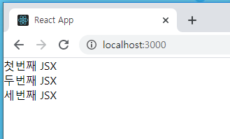

### ii) Key의 활용

- **엘리먼트**를 **리스트**에 넣고 사용할려면 **`key`**를 **attribute**로 줘야한다.

    `**key`의 값은 고유해야한다.** 꼭 정수가 아니어도 괜찮다. 문자열도 가능하다. 한 리스트안에서 각기 다른 `key` 값을 갖고 있으면 된다.
    
```jsx
    const jsxList = [<div key={1}>첫번째 JSX</div>, 
    				 <div key={2}>두번째 JSX</div>, 
                     <div key={3}>세번째 JSX</div>]
    
const componentList = [<Comp key={1}>첫번째 컴포넌트</Comp>,
                           <Comp key={2}>두번째 컴포넌트</Comp>,
                           <Comp key={3}>세번째 컴포넌트</Comp>]
```

솔직히 `key`를 **지정 안해줘도 작동은 잘된다.** 단지 리스트안에서의 혼동을 없앨려고 사용하는 건데.
    `key`를 지정 안하면 콘솔창에 에러 메세지가 나온다.
    
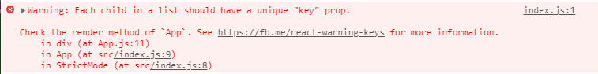
    
에러 메세지가 보기 싫기도 하고, 혹시 모를 버그를 방지하기 위해 **왠만하면 key를 지정해주자.**

### iii) React Fragment

- 기초편에서 **엘리먼트**를 설명할 때, **무조건 하나의 태그로 묶여있어야** **한다**고 언급했다.

    ```jsx
    const element1 = <div>이거는</div> <div>에러납니다.</div>
    
    const element2 = 
          <div>
              <div>무조건</div> 
              <div>하나의 태그로</div> 
              <div>묶여야합니다.</div> 
          </div>
    ```

- 그렇다면 우리는 무조건 `div`태그나 `span`태그로 묶어줘야하나?

    아니! **React**에서 제공하는 `Fragment`를 사용하면 된다.

    ```jsx
    import React from 'react'
    
    const element1 = 
          <React.Fragment>
              <div>무조건</div>
              <div>하나의 태그로</div>
              <div>묶여야합니다.</div>
          </React.Fragment>
    ```

    `Fragment`는 **아무 특성이 없는 태그**이다. 그냥 **하나로 묶어주기 위한 태그**이다.

    DOM 구조에서 **부모 태그를 만나면 자연스럽게 흡수**되어 버린다.

    ```jsx
    const element1 = 
          <React.Fragment>
              <div>무조건</div>
              <div>하나의 태그로</div>
              <div>묶여야합니다.</div>
          </React.Fragment>
    
    <div>{element1}</div>
    
    // Fragment는 부모 태그에 흡수되어 버린다.
    // **<div>{element1}</div>**은 html 상에서 보면 밑에와 같다.
    
    <div>
     	<div>무조건</div>
        <div>하나의 태그로</div>
        <div>묶여야합니다.</div>
    </div>
    ```

- `Fragment`는 **간단하게 표현 가능**하다.

    ```jsx
    <React.Fragment>
    	<div>무조건</div>
        <div>하나의 태그로</div>
        <div>묶여야합니다.</div>
    </React.Fragment>
    
    // Fragment는 밑에 처럼 간단하게 표현할 수 있다.
    
    <>
    	<div>무조건</div> 
    	<div>하나의 태그로</div>
    	<div>묶여야합니다.</div>
    </>
    ```

- 리스트에 `Fragment`로 묶인 **엘리먼트**들을 저장할 경우에도 `key` 값을 당연히 지정해줘야겠지?

    이때 주의할 점! **간단한 표현식**에서는 `key`를 지정할 수 없다!

    ```jsx
    // 간단한 Fragment 표현식에서는 key 어트리뷰트가 안먹힌다. 밑에꺼는 에러 메세지 나온다.
    <key={0}>
    	<div>무조건</div> 
        <div>하나의 태그로</div>
    <div>묶여야합니다.</div>
    </>
    
    // Fragment에 key를 지정할려면 밑에 처럼 써야한다.
    <React.Fragment key={0}>
    	<div>무조건</div> 
    	<div>하나의 태그로</div>
    	<div>묶여야합니다.</div>
    </React.Fragment>
    ```

---

## 6) 제어 컴포넌트, 비제어 컴포넌트

- ~~아.... 이거 언급해야되나...........~~

- 간단하게... 진짜 간단한 설명만 하고 넘어가겠다.

- **제어 컴포넌트**에서 **form 데이터**는 **React 컴포넌트**에서 다루어진다.

  **비제어 컴포넌트**에서 **form 데이터**는 **DOM 자체**에서 다루어진다.

- `<input>`, `<select>`, `<textarea>` 등 유저의 입력을 받은 데이터를 **form 데이터**라고 한다.

- **제어 컴포넌트 ★**

    ```jsx
    // 이 처럼 태그 안에 value 어트리뷰트가 선언되어있고
    // 컴포넌트의 state 값으로 value가 제어되면 제어 컴포넌트
    <input type="text" value={this.state.value} onChange={this.handleChange}/>
    ```

- 비제어 컴포넌트

    ```jsx
    // 이 처럼 태그 안에 value 어트리뷰트가 없으면 비제어 컴포넌트
    <input type="text" onChange={this.handleChange}/>
    ```

    참고로 `<input type='file'/>`은 **읽기 전용**이기 때문에 무조건 **비제어 컴포넌트**이다. 

    ```jsx
    // 읽기 전용이기 때문에 value 어트리뷰트를 줄 수 없다. 따라서 비제어 컴포넌트이다.
    <input type="file"/>
    ```

- 대부분 경우에 폼을 구현하는데 **제어 컴포넌트를 사용하는 것이 좋다!!!!**

