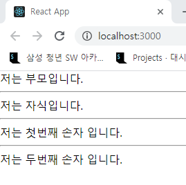
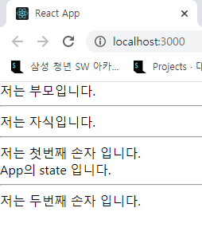
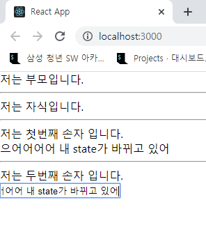
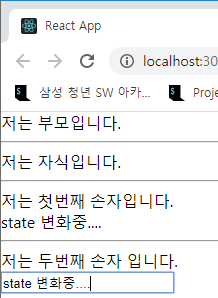

# [속성! 야매 React] 3. 고급편 (작성중)

Created: May 5, 2020 4:32 PM
Created By: Sinjae Kim
Tag: Frontend

**일단 해당 글을 읽고 이해 안가면 바로 카톡, 메러모스트 연락 바랍니다.**

<br/>

# 3. React 날라다니고 싶어? 네! ~~죄송합니다... 사실 저도잘 못합니다....~~

<br/>

## 1) Context API

- **전역 state 관리 라이브러리.**
- 우리는 상황에 따라 React 앱에서 전역으로 쓸 수 있는 변수가 필요하다.
ex) 유저 정보, 현재 페이지 정보, 기타 등등
- React 앱에서 변수로 쓰이는 state는 기본적으로 컴포넌트의 지역변수이다. 
그러면 **어떻게 전역변수로 사용할 수 있는가? 그걸 이제 Context API가 해준다.**
- 보통 컴포넌트 사이에서 state를 공유할려면 props로 넘겨주는 방식을 많이 쓴다. 
하지만, 컴포넌트의 깊이가 깊어지거나, 형제 관계의 컴포넌트끼리 state를 공유할려면 상당히 번거로워진다. 이때 Context API를 사용한다.
- 또한, **하위 컴포넌트에서 상위 컴포넌트의 state에 변화를 줄 때**도 사용한다.
- 마지막으로... **라우터 사이에 state를 공유하고 변화하기위해 사용**한다. 
솔직히 이게 주된 사용 목적이다.

- 그럼, Redux는?

    Redux도 Context API와 마찬가지로 전역 state를 관리해준다.

    뭐가 다른가?

    Context API는 **React에서 자체적으로 제공**하는 라이브러리이고,

    Redux는 3rd party 라이브러리이다.

    실제 규모가 큰 프로젝트의 경우 Redux를 많이 사용하기도 한다. 
    하지만, 우리가 이번 프로젝트에서 Redux를 쓰지않는 이유는...

    1. 처음 진입장벽이 있다.(카더라)
    2. Hook 기반이라 클래스형 컴포넌트를 사용하는 입장에서 혼동이 올 수 있다.
    3. 우리 정도의 프로젝트면 Context API로 충분하다고 생각한다.

- 예제를 통해 살펴보자
    - **App → Child → Grand1, Grand2**  의 구조를 갖는 React 앱을 생성해보자.
        - 예제 코드

            ```jsx
            // 귀찮아서 그냥 한 파일에 모든 컴포넌트들을 작성하겠음

            import React, { Component } from 'react';

            class App extends Component {
              render(){
                return(
                  <div>
                    저는 부모입니다.
                    <Child/>
                  </div>
                )
              }
            } export default App;

            class Child extends Component {
              render(){
                return(
                  <>
                    <div>
                      저는 자식입니다.
                    </div>
                    <hr/>
                    <Grand1/>
                    <hr/>
                    <Grand2/>
                  </>
                )
              }
            }

            class Grand1 extends Component {
              render(){
                return(
                  <div>
                    저는 첫번째 손자 입니다.
                  </div>
                )
              }
            }

            class Grand2 extends Component {
              render(){
                return(
                  <div>
                    저는 두번째 손자 입니다.
                  </div>
                )
              }
            }
            ```

        - 결과화면
    
        
- 그 다음 Context API를 적용해보자. 이때, App의 state를 전역 state로 지정하고, Child를 건너뛰어서 Grand1에서 전역 state를 사용해 보겠다.
        - 예제 코드
    
        ```jsx
            import React, { Component } from 'react';
    
        // 먼저 React.createContext 객체를 생성한다. context객체는 중간다리 역할을 해준다.
            const GlobalState = new React.createContext(); 
    
        class App extends Component {
              constructor(props){
                super(props);
                this.state = {
                  appState: 'App의 state 입니다.'
                }
              }
    
          render(){
                return(
            			// context객체에 this.state를 심고, 하위 컴포넌트들에게 제공하겠다는 의미이다.
                  <GlobalState.Provider value={this.state}> 
                    <div>
                      저는 부모입니다.
                    </div>
                    <hr/>
                    <Child/>
                  </GlobalState.Provider>
                )
              }
            } export default App;
    
        class Child extends Component {
            	/* 생략 */
            }
    
        class Grand1 extends Component {
              render(){
                return(
                  // context 객체에 심어진 전역변수를 참조하려면, 밑에처럼 컴포넌트를 선언해준다.
                  <GlobalState.Consumer> 
                  {global => ( // 그리고 Consumer 컴포넌트 안에는 함수식으로 리턴을 해준다. 
                               // 이때 파라미터 명은 아무렇게나 선언해도 된다.
                    <>
                      <div>
                        저는 첫번째 손자 입니다.
                      </div>
                      {global.appState}
                    </>
                  )}
                  </GlobalState.Consumer>
                )
              }
            }
    
        class Grand2 extends Component {
              /* 생략 */
            }
            ```
    
    - 결과화면
        
    
    - 이제 Context API를 통해서 Grand2에서 App의 state를 업데이트 해보자.
    - 예제 코드
    
            ```jsx
        import React, { Component } from 'react';
    
            const GlobalState = new React.createContext();

            class App extends Component {
          constructor(props){
                super(props);
                this.state = {
                  appState: 'App의 state 입니다.',
    
            			// App의 state에 변화를 주어야하기 때문에 이벤트 콜백은 App안에 선언해야한다.
        			// 그리고 이벤트 콜백을 App의 state로 지정하여 전역으로 사용할 수 있게 해야한다.
                  changeAppState: this.changeAppState
                }
              }
    
              changeAppState = (e) => {
            this.setState({
                  appState: e.currentTarget.value
                })
              }
    
              render(){
            return(
                  // context객체에 this.state를 심고, 하위 컴포넌트들에게 제공하겠다는 의미이다.
                  <GlobalState.Provider value={this.state}> 
                    <div>
                      저는 부모입니다.
                    </div>
                    <hr/>
                    <Child/>
                  </GlobalState.Provider>
                )
              }
            } export default App;
    
            /* 생략 */

            class Grand2 extends Component {
          render(){
                return(
                  <GlobalState.Consumer> 
                  {global => ( 
                    <>
                      <div>
                        저는 두번째 손자 입니다.
                      </div>
            					
            					{/* onChange에 context 객체에 심어진 이벤트 콜백을 지정하면 된다. */}
                      <input type="text" value={global.appState} onChange={global.changeAppState}/>
                    </>
                  )}
                  </GlobalState.Consumer>
                )
              }
            }
            ```
    
        - 결과화면
    
        
- 사실 `Consumer` 컴포넌트를 사용하다보면 불편한 점이 생기는데...
    바로 `render` 메서드 안에서 밖에 못쓴다는 것과 코드가 좀 더러워진다는 점이다.

        이때 사용하는 것이 **`contextType`**이다.
    
    **`contextType`**은 상위 컴포넌트 중 가장 가까운 `Provider`를 찾아 그 값을 읽을 수 있게 해준다.
        그리고 `render` 메서드 뿐만아니라 모든 생명주기 메서드에 사용 가능하다.

        - 예제 코드
    
        ```jsx
            // Grand1을 contextType을 이용해서 변환해보자

            // 일단 이거는 Consumer를 사용한 기존 코드
            class Grand1 extends Component {
          render(){
                return(      
                  <GlobalState.Consumer> 
                  {global => (                    
                    <>
                      <div>
                        저는 첫번째 손자 입니다.
                      </div>
                      {global.appState}
                    </>
                  )}
                  </GlobalState.Consumer>
                )
              }
            }
    
            // contextType을 사용하면 밑에와 같다.
            class Grand1 extends Component {
        	render(){
            		return(
            			<>
                    <div>
                      저는 첫번째 손자 입니다.
                    </div>
                    {this.context.appState}
                  </>
            		)
            	}
    
            } Grand1.contextType = GlobalState; // 이렇게 선언해주면 가장 가까운 context를 읽을 수 있다.
            ```

            물론 결과는 같다.
    

<br/>

---

<br/>

## 2) Ref

- 뭐 솔직히 필자도 많이 써보지는 않았다. 
딱히 쓸일이 없고 굳이 사용할 일이 없기 때문이다... (일단 대안이 많음)

<br/>

---

<br/>

## 3) Router

<br/>

---

<br/>

## 4) Portal?