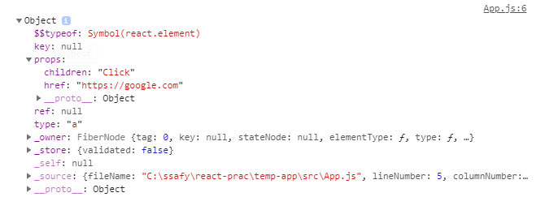

# 2. React 다시 알기

<br/>

## 1. 상태값과 속성값으로 관리하는 UI 데이터

UI 데이터는 컴포넌트 내부에서 관리되는 상태값(state)과 부모 컴포넌트에서 내려주는 속성값(props)로 구성된다.

UI 데이터가 변경되면 화면을 다시 그려야 한다. React와 같은 UI 라이브러리를 사용하지 않으면, **UI 데이터가 변경될 때마다 DOM 요소를 직접 수정**해야한다.<br/>하지만, DOM 요소를 직접 수정하다 보면 **비즈니스 로직과 UI를 수정하는 코드가 뒤섞이고, 코드가 복잡**해진다. 

그래서 React는 **화면을 그리는 모든 코드를 함수에 선언형으로 작성**하도록 했다. UI 데이터가 변경되면 **React가 컴포넌트 함수를 이용해서 화면을 자동으로 갱신**해 주며, 이것이 리액트의 가장 중요한 역할이다.

<br/>

### React 코드의 특징

JS와 jQuery와 같이 **화면을 어떻게 그리는지 나타내는 방식**을 **명령형(imperative) 프로그래밍**이라고 한다.

React와 같이 **화면이 무엇을 그리는지 나타내는 방식**을 **선언형(declarative) 프로그래밍**이라고 한다.

**명령형** 프로그래밍의 경우 DOM을 **직접 수정하면서 화면을 어떻게 그리는지 구체적**으로 나타낸다. 때문에 **DOM 환경이 아닌 곳에서는 사용하기 힘들다.**

반면, **선언형** 프로그래밍의 경우 **무엇을 그리는지만 나타내**기 때문에 **다양한 방식**으로 그릴 수 있다. 컴포넌트 함수가 반환하는 코드는 선언형이기 때문에 React는 **DOM 환경뿐만 아니라 모바일 네이티브의 UI도 표현**할 수 있다.

따라서 **명령형보다 선언형 프로그래밍이 추상화 단계가 높다**고 할 수 있다. 추상화 단계가 높을수록 **비즈니스 로직에 좀 더 집중**할 수 있다.

<br/>

### 컴포넌트의 속성값, 상태값

React에서 UI 데이터는 무조건 속성값과 상태값으로 관리해야한다. 그렇지 않으면 UI 데이터가 변경되어도 화면이 갱신되지 않는다.

다음 코드를 보자

```jsx
let color = 'red';
function MyComponent(){
    function onClick(){
        color = 'blue';
    }
    return(
    	<button style={{ backgroundColor: color }} onClick={onClick}>
        	좋아요
        </button>
    );
}
```

클릭 이벤트가 발생해도 버튼 색이 바뀌지 않는다. UI 데이터가 변경됐다는 사실을 React가 모르기 때문이다.

컴포넌트의 상태값(state) 혹은 속성값(props)을 이용하면 React가 UI 데이터의 변경을 알 수 있다. 위의 코드를 상태값(state)을 포함하여 작성하면 다음과 같다.

```jsx
import React, { useState } from 'react';

function MyComponent(){
    const [color, setColor] = useState('red'); // 컴포넌트에 상태값을 추가할 때는 useState Hook을 사용하다.
    function onClick(){
        setColor('blue');
    }
    return(
    	<button style={{ backgroundColor: color }} onClick={onClick}>
        	좋아요
        </button>
    )
}
```

추가적으로, 같은 컴포넌트를 여러 번 사용할 수도 있다. 각 컴포넌트는 상태값을 위한 자신만의 메모리 공간이 있기에, 같은 컴포넌트라도 자신만의 상태값이 존재한다.


### React.memo

자식 컴포넌트는 부모 컴포넌트가 렌더링될 때마다 같이 렌더링 된다. 만약 부모로부터 받은 속성값(props)이 변경될 때만 렌더링되길 원한다면 `React.memo`를 이용할 수 있다.

```jsx
import React, { useState } from 'react';
import Title from './Title.js';

function Todo(){
    const [count, setCount] = useState(0);
    function onClick(){
        setCount(count + 1);
    }
    return (
    	<div>
        	<Title title={`카운트: ${count}`} />
            <button onClick={onClick}>증가</button>
        </div>
    )
}
```

```jsx
// Title.js
function Title(props){
    return <p>{props.title}</p>;
}
export default React.memo(Title);
```


<br/>

### 불변 객체로 관리하는 속성값, 상태값

props는 불변(immutable) 변수이지만, state는 불변 변수가 아니다. 하지만 state도 불변 변수로 관리하는게 좋다. 불변 변수로 관리하면 코드의 복잡도가 낮아진다.

---

<br/>

## 2. 컴포넌트 함수의 반환값

1. 컴포넌트
2. HTML에 정의된 거의 모든 태그
3. 문자열, 숫자
4. 배열
   - 리액트 요소의 배열이라면, 각 리액트 요소는 key 속성값을 갖고 있어야 한다.
5. Fragment
   - Fragment 내부의 리액트 요소는 key 값을 부여하지 않아도 된다.
6. null, boolean
   - 아무것도 렌더링하지 않는다.
7. React Portal

---

<br/>

## 3. React 요소와 가상DOM

React는 렌더링 성능을 위해 가상DOM을 사용한다.

브라우저에서 DOM을 변경하는 것은 비교적 오래 걸린다. 따라서 빠른 렌더링을 위해서는 DOM 변경을 최소화해야한다.

그래서 React는 메모리에 가상DOM을 올려 놓고 이전과 이후의 가상DOM을 비교해서 변경된 부분만 실제 DOM에 반영하는 전략을 채택했다.

<br/>

### React 요소의 이해

JSX 문법으로 작성된 코드는 바벨을 통해 `createElement` 함수로 변경된다. `createElement` 함수는 React 요소를 반환한다.

```jsx
const element = <a href="https://google.com">Click</a>;
// 위의 JSX 문법은 밑의 createElement 함수를 사용한 코드로 변경된다.
const element = React.createElement(
	'a',
    { href: 'https://google.com' },
    'Click'
)
```

다음은 `createEleme` 함수가 반환하는 React 요소의 구조를 보여준다.



React 요소는 불변 객체이기 때문에 속성값을 변경할 수 없다.

```jsx
const element = <a href="https://google.com">Click</a>;
element.type = 'span'; // 에러 발생
```

<br/>

### React 요소가 DOM 요소로 만들어지는 과정

하나의 화면을 표현하기 위해 **여러 개의 React 요소가 트리 구조로 구성**된다. 하나의 React 요소 트리는 시간에 따라 변화하는 화면의 한 순간을 나타낸다.

React에서 **데이터 변경에 의한 화면 업데이트**는 **렌더 단계**와 **커밋 단계**를 거친다. **렌더**는 **실제 DOM에 반영할 변경 사항을 파악하는 단계**이고, **커밋**은 **파악된 변경 사항을 실제 DOM에 반영하는 단계**이다. **렌더 단계**에서 변경 사항을 파악하기 위해 **가상DOM**을 이용한다.

가상DOM은 React 요소로부터 만들어진다. React는 **렌더링을 할 때마다 가상DOM을 만들고 이전의 가상DOM과 비교**한다.

React 요소의 type이 컴포넌트라면, 컴포넌트 함수를 호출해서 type이 HTML 태그를 나타내는 문자열로 바뀐다.

모든 React 요소의 type이 문자열로 바뀌면, 그 때부터 실제 DOM에 반영할 수 있는 상태가 된 것이다.

**렌더 단계는 `ReactDOM.render()`와 state 변경 함수에 의해 시작**된다.

> 엄밀히 말하면 React 요소는 파이버(fiber)라는 구조체로 변환된다. 파이버는 React 16 버전부터 도입된 구조체이다.
>
> 파이버도 React 요소와 같이 type, props 속성값을 가진다. 파이버로 동작할 때도 모든 type 속성값이 문자열이 될 때까지 연산한 다는 사실은 변합이 없다.