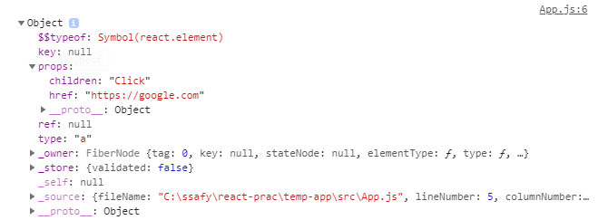

# 2. React 다시 알기

<br/>

## 1. 상태값과 속성값으로 관리하는 UI 데이터

UI 데이터는 컴포넌트 내부에서 관리되는 상태값(state)과 부모 컴포넌트에서 내려주는 속성값(props)로 구성된다.

UI 데이터가 변경되면 화면을 다시 그려야 한다. React와 같은 UI 라이브러리를 사용하지 않으면, **UI 데이터가 변경될 때마다 DOM 요소를 직접 수정**해야한다.<br/>하지만, DOM 요소를 직접 수정하다 보면 **비즈니스 로직과 UI를 수정하는 코드가 뒤섞이고, 코드가 복잡**해진다. 

그래서 React는 **화면을 그리는 모든 코드를 함수에 선언형으로 작성**하도록 했다. UI 데이터가 변경되면 **React가 컴포넌트 함수를 이용해서 화면을 자동으로 갱신**해 주며, 이것이 리액트의 가장 중요한 역할이다.

<br/>

### React 코드의 특징

JS와 jQuery와 같이 **화면을 어떻게 그리는지 나타내는 방식**을 **명령형(imperative) 프로그래밍**이라고 한다.

React와 같이 **화면이 무엇을 그리는지 나타내는 방식**을 **선언형(declarative) 프로그래밍**이라고 한다.

**명령형** 프로그래밍의 경우 DOM을 **직접 수정하면서 화면을 어떻게 그리는지 구체적**으로 나타낸다. 때문에 **DOM 환경이 아닌 곳에서는 사용하기 힘들다.**

반면, **선언형** 프로그래밍의 경우 **무엇을 그리는지만 나타내**기 때문에 **다양한 방식**으로 그릴 수 있다. 컴포넌트 함수가 반환하는 코드는 선언형이기 때문에 React는 **DOM 환경뿐만 아니라 모바일 네이티브의 UI도 표현**할 수 있다.

따라서 **명령형보다 선언형 프로그래밍이 추상화 단계가 높다**고 할 수 있다. 추상화 단계가 높을수록 **비즈니스 로직에 좀 더 집중**할 수 있다.

<br/>

### 컴포넌트의 속성값, 상태값

React에서 UI 데이터는 무조건 속성값과 상태값으로 관리해야한다. 그렇지 않으면 UI 데이터가 변경되어도 화면이 갱신되지 않는다.

다음 코드를 보자

```jsx
let color = 'red';
function MyComponent(){
    function onClick(){
        color = 'blue';
    }
    return(
    	<button style={{ backgroundColor: color }} onClick={onClick}>
        	좋아요
        </button>
    );
}
```

클릭 이벤트가 발생해도 버튼 색이 바뀌지 않는다. UI 데이터가 변경됐다는 사실을 React가 모르기 때문이다.

컴포넌트의 상태값(state) 혹은 속성값(props)을 이용하면 React가 UI 데이터의 변경을 알 수 있다. 위의 코드를 상태값(state)을 포함하여 작성하면 다음과 같다.

```jsx
import React, { useState } from 'react';

function MyComponent(){
    const [color, setColor] = useState('red'); // 컴포넌트에 상태값을 추가할 때는 useState Hook을 사용하다.
    function onClick(){
        setColor('blue');
    }
    return(
    	<button style={{ backgroundColor: color }} onClick={onClick}>
        	좋아요
        </button>
    )
}
```

추가적으로, 같은 컴포넌트를 여러 번 사용할 수도 있다. 각 컴포넌트는 상태값을 위한 자신만의 메모리 공간이 있기에, 같은 컴포넌트라도 자신만의 상태값이 존재한다.


### React.memo

자식 컴포넌트는 부모 컴포넌트가 렌더링될 때마다 같이 렌더링 된다. 만약 부모로부터 받은 속성값(props)이 변경될 때만 렌더링되길 원한다면 `React.memo`를 이용할 수 있다.

```jsx
import React, { useState } from 'react';
import Title from './Title.js';

function Todo(){
    const [count, setCount] = useState(0);
    function onClick(){
        setCount(count + 1);
    }
    return (
    	<div>
        	<Title title={`카운트: ${count}`} />
            <button onClick={onClick}>증가</button>
        </div>
    )
}
```

```jsx
// Title.js
function Title(props){
    return <p>{props.title}</p>;
}
export default React.memo(Title);
```


<br/>

### 불변 객체로 관리하는 속성값, 상태값

props는 불변(immutable) 변수이지만, state는 불변 변수가 아니다. 하지만 state도 불변 변수로 관리하는게 좋다. 불변 변수로 관리하면 side-effect를 줄이고, 코드의 복잡도가 낮아진다.

```jsx
function MyComponent(){
	const [count, setCount] = useState({ value: 0 });
    function onClick(){
        count.value = 2; // 상태값이 변경되지 않는다.
        setCount(count); // 상태값이 변경되지 않는다. 
    }
    /*...*/
}
```


---

<br/>

## 2. 컴포넌트 함수의 반환값

1. 컴포넌트
2. HTML에 정의된 거의 모든 태그
3. 문자열, 숫자
4. 배열
   - 리액트 요소의 배열이라면, 각 리액트 요소는 key 속성값을 갖고 있어야 한다.
5. Fragment
   - Fragment 내부의 리액트 요소는 key 값을 부여하지 않아도 된다.
6. null, boolean
   - 아무것도 렌더링하지 않는다.
7. React Portal

---

<br/>

## 3. React 요소와 가상DOM

React는 렌더링 성능을 위해 가상DOM을 사용한다.

브라우저에서 DOM을 변경하는 것은 비교적 오래 걸린다. 따라서 빠른 렌더링을 위해서는 DOM 변경을 최소화해야한다.

그래서 React는 메모리에 가상DOM을 올려 놓고 이전과 이후의 가상DOM을 비교해서 변경된 부분만 실제 DOM에 반영하는 전략을 채택했다.

<br/>

### React 요소의 이해

JSX 문법으로 작성된 코드는 바벨을 통해 `createElement` 함수로 변경된다. `createElement` 함수는 React 요소를 반환한다.

```jsx
const element = <a href="https://google.com">Click</a>;
// 위의 JSX 문법은 밑의 createElement 함수를 사용한 코드로 변경된다.
const element = React.createElement(
	'a',
    { href: 'https://google.com' },
    'Click'
)
```

다음은 `createEleme` 함수가 반환하는 React 요소의 구조를 보여준다.



React 요소는 불변 객체이기 때문에 속성값을 변경할 수 없다.

```jsx
const element = <a href="https://google.com">Click</a>;
element.type = 'span'; // 에러 발생
```

<br/>

### React 요소가 DOM 요소로 만들어지는 과정

하나의 화면을 표현하기 위해 **여러 개의 React 요소가 트리 구조로 구성**된다. 하나의 React 요소 트리는 시간에 따라 변화하는 화면의 한 순간을 나타낸다.

React에서 **데이터 변경에 의한 화면 업데이트**는 **렌더 단계**와 **커밋 단계**를 거친다. **렌더**는 **실제 DOM에 반영할 변경 사항을 파악하는 단계**이고, **커밋**은 **파악된 변경 사항을 실제 DOM에 반영하는 단계**이다. **렌더 단계**에서 변경 사항을 파악하기 위해 **가상DOM**을 이용한다.

가상DOM은 React 요소로부터 만들어진다. React는 **렌더링을 할 때마다 가상DOM을 만들고 이전의 가상DOM과 비교**한다.

React 요소의 type이 컴포넌트라면, 컴포넌트 함수를 호출해서 type이 HTML 태그를 나타내는 문자열로 바뀐다.

모든 React 요소의 type이 문자열로 바뀌면, 그 때부터 실제 DOM에 반영할 수 있는 상태가 된 것이다.

**렌더 단계는 `ReactDOM.render()`와 state 변경 함수에 의해 시작**된다.

> 엄밀히 말하면 React 요소는 파이버(fiber)라는 구조체로 변환된다. 파이버는 React 16 버전부터 도입된 구조체이다.
>
> 파이버도 React 요소와 같이 type, props 속성값을 가진다. 파이버로 동작할 때도 모든 type 속성값이 문자열이 될 때까지 연산한 다는 사실은 변합이 없다.

---

<br/>

## 4. Context API

하위 컴포넌트의 깊이가 깊어지면, 속성값을 내려 주는 코드를 반복적으로 작성해야 한다. 추적이 힘들어져서 유지보수가 어려워진다.

이럴 때, 콘텍스트 API를 사용하면 컴포넌트의 중첩 구조가 복잡한 상황에서도 비교적 쉽게 데이터를 전달할 수 있다.

콘텍스트 API는 상위 컴포넌트에서 하위에 있는 모든 컴포넌트들에게 직접 선택적으로 데이터를 전달할 수 있다.

```jsx
// TestCtxt.js
import React from 'react';

const UserContext = React.createContext('');

export default function TestCtxt(){
  return (
    <div>
      <UserContext.Provider value={'SinJ'}>
        <div>상단메뉴</div>
        <Profile/>
        <div>하단메뉴</div>
      </UserContext.Provider>
    </div>
  )
}

function Profile(){
  return (
    <div>
      <Greeting/>
    </div>
  )
}

function Greeting(){
  return (
    <UserContext.Consumer>
      {username => <p>{`${username}님 안녕하세요`}</p>}
    </UserContext.Consumer>
  )
}
```

`createContext()`를 호출하면 콘텍스트 객체가 생성된다. 

```jsx
// createContext() 함수 구조
React.createContext(defaultValue) => {Provider, Consumer}
```

- 상위 컴포넌트에서는 `Provider` 컴포넌트를 이용해서 데이터를 전달한다.
- 하위 컴포넌트에서는 `Consumer` 컴포넌트를 이용해서 데이터를 사용한다.

`Consumer` 컴포넌트는 데이터를 찾기 위해 상위로 올라가면서 가장 가까운 `Provider` 컴포넌트를 찾는다. 만약 최상위까지 `Provider`를 찾지 못하면 기본값이 사용된다.

`Provider` 컴포넌트의 속성값이 변경되면 **하위의 모든 `Consumer` 컴포넌트는 다시 렌더링** 된다. 중요한 점은 중간에 위치한 컴포넌트의 여부와 상관없이 다시 렌더링 된다.

```jsx
// TestCtxt.js
import React, { useState } from 'react'

const UserContext = React.createContext('');

export default function TestCtxt2(){
  const [username, setUsername] = useState('');
  console.log('render TestCtxt2');
  return (
    <div>
      <UserContext.Provider value={username}>
        <Profile/>
        <input 
          type="text"
          value={username}
          onChange={e => setUsername(e.target.value)}
        />
      </UserContext.Provider>
    </div>
  )
}

const Profile = React.memo(() => { // 속성값이 없기 때문에 최초 한 번만 렌더링
  console.log('render Profile');
  return (
    <div>
      <Greeting/>
    </div>
  );
});

function Greeting(){
  return (
    <UserContext.Consumer>
      {username => {
        console.log('render Greeting');
        return <p>{`${username}님 안녕하세요`}</p>
      }}
    </UserContext.Consumer>
  );
}
```


<br/>

### Context API 활용

#### 1. 여러 콘텍스트를 중첩해서 사용하기

```jsx
// TestMultiCtxt.js
import React from 'react'

const UserContext = React.createContext('');
const ThemeContext = React.createContext('dark');

export default function TestMultiCtxt() {
  return (
    <div>
      <ThemeContext.Provider value={'light'}>
        <UserContext.Provider value={'SinJ'}>
          <div>상단 메뉴</div>
          <Profile/>
          <div>하단 메뉴</div>
        </UserContext.Provider>
      </ThemeContext.Provider>
    </div>
  );
}

function Profile() {
  return (
    <div>
      <Greeting/>
    </div>
  );
}

function Greeting() {
  return (
    <ThemeContext.Consumer>
      {theme => (
        <UserContext.Consumer>
          {username => (
            <p 
              style={{ color: theme === 'dark' ? 'gray' : 'green' }}
            >{`${username}님 안녕하세요`}</p>
          )}
        </UserContext.Consumer>
      )}
    </ThemeContext.Consumer>
  );
}
```

두 개의 `Provider` 컴포넌트를 중첩해서 사용할 수 있다. `Consumer` 도 마찬가지 이다.

렌더링 성능상 이점이 없긴 하지만, 보통 이렇게 종류별로 콘텍스트를 만들어서 사용하면 렌더링 성능상 이점이 있다. 이는 데이터 변경 시 해당 `Consumer`  컴포넌트만 렌더링되기 때문이다.

<br/>

#### 2. 하위 컴포넌트에서 콘텍스트 데이터를 수정하기

리덕스에서 상태를 변경하는 디스패치(dispatch) 함수를 여러 컴포넌트에서 사용할 수 있는 것처럼, 콘텍스트 데이터도 원하는 곳에서 변경할 수 있다.

```jsx
// TestChangeCtxt.js
import React, { useState, useEffect } from 'react';

const UserContext = React.createContext({ username: "", helloCount: 0 });
const SetUserContext = React.createContext(() => {}); // 함수 전달 콘텍스트

export default function TestChangeCtxt() {
  const [user, setUser] = useState({ username: 'SinJ', helloCount: 0 });

  return (
    <div>
      <SetUserContext.Provider value={setUser}>
        <UserContext.Provider value={user}>
          <Profile/>
        </UserContext.Provider>
      </SetUserContext.Provider>
    </div>
  );
}

function Profile() {
  return (
    <div>
      <Greeting/>
    </div>
  );
}

function Greeting() {
  return (
    <SetUserContext.Consumer>
      {setUser => (
        <UserContext.Consumer>
          {({username, helloCount}) => (
            <>
              <p>{`${username}님 안녕하세요`}</p>
              <p>{`인사 횟수: ${helloCount}`}</p>
              <button
                onClick={() => setUser({username, helloCount: helloCount + 1})}
              >
                인사하기
              </button>
            </>
          )}
        </UserContext.Consumer>
      )}
    </SetUserContext.Consumer>
  );
}
```

수정하는 함수를 전달하기 위한 콘텍스트를 생성하고 `Provider`를 통해 전달한다.

<br/>

### 주의할 점

#### 1. 불필요한 렌더링 발생

콘텍스트 데이터로 **객체를 사용할 때 주의하지 않으면 불필요한 렌더링이 발생**할 수 있다.

```jsx
const UserContext = React.createContext({ username: '' });

function App() {
    const [username, setUsername] = useState('');
    return (
    	<div>
        	<UserContext.Provider value={{ username }}>
            //...
        </div>    
    )
}
```

콘텍스트 데이터로 객체를 전달하고 있다. 이처럼 작성하면 **컴포넌트가 렌더링될 때마다 새로운 객체가 생성**된다. 따라서 `username` 값이 **변경되지 않아도, 컴포넌트가 렌더링될 때마다 `Consumer` 컴포넌트도 다시 렌더링**된다. 

위의 문제를 해결하려면 다음과 같이 작성해야한다.

```jsx
const UserContext = React.createContext({ username: '' });

function App() {
    const [user, setUsername] = useState({ username: '' });
    return (
    	<div>
        	<UserContext.Provider value={user}>
            //...
        </div>    
    )
}
```

콘텍스트 데이터 자체를 상탯값으로 관리한다. `username` 값이 변경될 때만 새로운 객체가 전달되므로 불필요한 렌더링이 발생하지 않는다.

<br/>

#### 2. Provider를 찾지 못하는 경우

`Consumer`와 `Provider`를 적절한 위치에서 사용하지 않으면 콘텍스트 데이터가 전달되지 않는다.

앞서 말했듯이 `Consumer`가 최상위에 도달할 때까지 `Provider`를 찾지 못하면 콘텍스트 데이터의 기본값이 사용된다.

---

<br/>

## 5. ref

React로 작업하다 보면 **DOM 요소에 직접 접근**해야 할 때가 있다. DOM 요소에 포커스를 주거나, DOM 요소의 크기나 스크롤 위치를 알고 싶은 경우다.

이때 **ref 속성값을 이용하면 자식 요소에 직접 접근**할 수 있다. 자식 요소는 컴포넌트일 수도 있고 DOM 요소일 수도 있다.

<br/>

### ref 속성값의 이해

다음은 `ref`를 이용해서 DOM 요소를 제어하는 코드다.

```jsx
// TestRef.js
import React, { useRef, useEffect } from 'react';

export default function TestRef() {
  const inputRef = useRef();

  useEffect(() => {
    inputRef.current.focus();
  }, []);

  return (
    <div>
      <input type="text" ref={inputRef}/>
      <button>저장</button>
    </div>
  )
}
```

`useRef` 훅이 반환하는 ref 객체를 이용해서 자식 요소에 접근할 수 있다. 접근하고자 하는 자식 요소의 ref 속성에 ref 객체를 입력하면, 해당 DOM 요소 혹은 컴포넌트가 생성되면 ref 객체로 접근할 수 있다. ref 객체의 current 속성을 이용하면 자식 요소에 접근할 수 있다.

`useEffect` 훅 내부에서 자식요소에 접근하고 있다는 점에 주목하자. 부수 효과 함수는 컴포넌트 렌더링 결과가 DOM에 반영된 후에 호출되므로 해당 DOM 요소는 이미 생성된 상태다.

<br/>

### ref 활용

#### 1. 함수형 컴포넌트에서 ref 사용하기

클래스형 컴포넌트에 `ref` 속성값을 입력하면 `ref.current`는 **해당 컴포넌트의 인스턴스**를 가리킨다. 따라서 `ref.current`를 통해 해당 클래스의 메서드를 호출할 수 있다.

함수형 컴포넌트는 인스턴스로 만들어지지 않지만, `useImperativeHandle` 훅을 사용하면 함수형 컴포넌트에서도 변수와 함수를 외부로 노출시킬 수 있다.

함수형 컴포넌트에 `ref` 속성값을 입력할 수는 없지만, 다른 이름으로 `ref` 객체를 입력받아서 내부의 리액트 요소에 연결할 수 있다. 속성값을 함수의 매개변수로 입력받으면 된다.

```jsx
// TestInputRef.js
import React, { useRef, useEffect } from 'react';

export default function TestInputRef() {
  const inputRef = useRef();
  useEffect(() => {
    inputRef.current.focus();
  }, []);

  return (
    <div>
      <TextInput inputRef={inputRef}/>
      <button onClick={() => inputRef.current.focus()}>텍스트로 이동</button>
    </div>
  )
}

function TextInput({ inputRef }) {
  return (
    <div>
      <input type="text" ref={inputRef}/>
      <button>저장</button>
    </div>
  );
}
```

위의 코드와 같이 `inputRef` 속성값을 input의 `ref` 속성값으로 넣고있다. 부모 컴포넌트 입장에서는 손자 요소에 `ref` 속성값을 넣는 형태가 된다.

하지만, 위와 같은 방법은 **컴포넌트의 내부 구조를 외부에서 알아야 하므로 좋은 방법은 아니다. **꼭 필요한 경우에만 사용하는 것이 좋다.

<br/>

#### 2. `forwardRef()`로 ref 속성값 직접 처리하기

재사용 성을 높이기 위해 Button 처럼 단순한 컴포넌트를 만들어서 사용하는 경우가 많다. 이런 작은 컴포넌트는 DOM 요소와 밀접하게 연관되어 있기 때문에 `ref`를 손자 요소로 연결하는 게 자연스럽다.

하지만 컴포넌트에 `ref` 속성을 사용하면 React가 내부적으로 처리하기 때문에 손자 요소에 연결할 수 없다.

이럴 때 `forwardRef()`를 사용하면 `ref` 속성값을 직접 처리할 수 있다.

```jsx
// TestForwardRef.js
import React, { useRef, useEffect } from 'react';

export default function TestForwardRef() {
  const inputRef = useRef();
  useEffect(() => {
    inputRef.current.focus();
  }, []);

  return (
    <div>
      <TextInput ref={inputRef}/>
      <button onClick={() => inputRef.current.focus()}>텍스트로 이동</button>
    </div>
  )
}

const TextInput = React.forwardRef((props, ref) => (
  <div>
    <input type="text" ref={ref}/>
    <button>저장</button>
  </div>
));
```

`forwardRef()`를 이용하면 부모 컴포넌트에서 넘어온 `ref` 속성값을 직접 처리할 수 있다. 이전에 `inputRef`로 사용했던 이름을 React의 예약어인 `ref`로 사용할 수 있다.

<br/>

#### 3. ref 속성값으로 함수 사용하기

`ref` 속성값에 **함수를 입력하면 자식 요소가 생성되거나 제거되는 시점에 호출**된다.

```jsx
// TestFuncRef.js
import React, { useState } from 'react';

const INITIAL_TEXT = '안녕하세요';

export default function TestFuncRef() {
  const [text, setText] = useState(INITIAL_TEXT);
  const [showText, setShowText] = useState(true);

  return (
    <div>
      {showText && (
        <input 
          type="text"
          ref={ref => ref && setText(INITIAL_TEXT)}
          value={text}
          onChange={e => setText(e.target.value)}
        />
      )}
      <button onClick={() => setShowText(!showText)}>
        보이기/가리기
      </button>
    </div>
  );
}
```

`ref` 속성값으로 입력한 함수는 해당 요소가 제거되거나 생성될 때마다 호출된다. 요소가 생성될 때는 해당 요소를 참조하는 변수가 넘어오고, 삭제될 때는 null 값이 넘어온다. 따라서 위의 코드에서 `button` 요소가 생성될 때만 `INITIAL_TEXT`가 입력되도록 했다.

하지만 코드를 실행하면 의도한 대로 동작하지 않는다. `input` 요소에 텍스트를 입력해도 화면에는 `INITIAL_TEXT`만 보인다. 컴포넌트가 **렌더링될 때마다 새로운 함수를 `ref` 속성값**으로 넣기 때문이다. React는 `ref` 속성값으로 새로운 함수가 들어오면 이전 함수에 `null` 인수를 넣어서 호출하고, 새로운 함수에는 요소의 참조값을 넣어서 호출한다. 따라서 텍스트를 입력하면 컴포넌트가 렌더링되고, `ref` 속성값에 입력된 새로운 함수가 호출되면서 `INITIAL_TEXT`로 덮어 쓰는 것이다.

위와 같은 문제는 다음과 같이 **고정된 함수**를 입력하면 해결된다.

```jsx
// TestFuncRef2.js
import React, { useState, useCallback } from 'react';

const INITIAL_TEXT = '안녕하세요';

export default function TestFuncRef2() {
  const [text, setText] = useState(INITIAL_TEXT);
  const [showText, setShowText] = useState(true);

  const setInitialText = useCallback(
    ref => ref && setText(INITIAL_TEXT),
    []);

  return (
    <div>
      {showText && (
        <input 
          type="text"
          ref={setInitialText}
          value={text}
          onChange={e => setText(e.target.value)}
        />
      )}
      <button onClick={() => setShowText(!showText)}>
        보이기/가리기
      </button>
    </div>
  );
}
```

`useCallback` 훅을 이용해서 `setInitialText()` 함수를 변하지 않게 했다. `useCallback`의 메모이제이션 기능 덕분에 한 번 생성된 함수를 계속 재사용한다는 것만 알아두자.

`ref` 속성값에 새로운 함수를 입력하지 않으므로, `input` 요소가 생성되거나 제거될 때만 `setInitialText()` 함수가 호출된다.

이렇게 `ref` 속성값으로 함수를 사용하면 DOM 요소의 생성과 제거 시점을 알 수 있다. 

<br/>

#### 4. ref 속성값 사용 시 주의할 점

컴포넌트가 생성된 이후라도 `ref` 객체의 **current 속성이 없을 수 있기 때문**에 주의해야 한다.

```jsx

```

